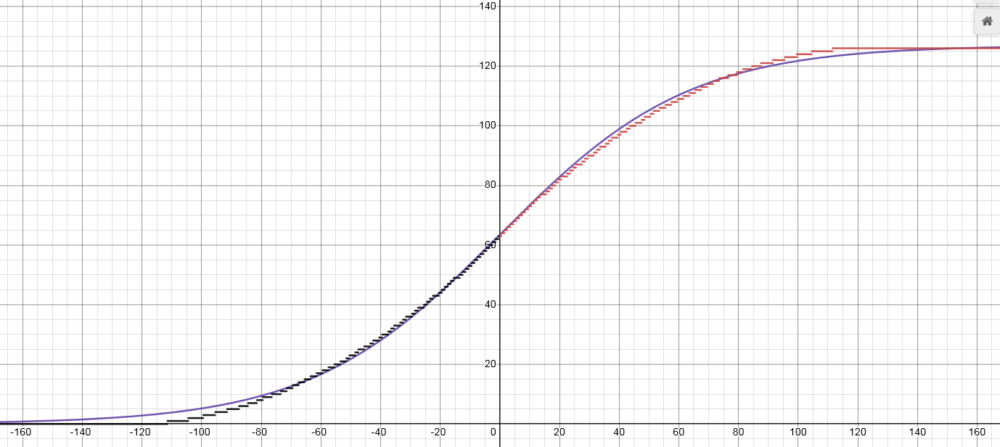
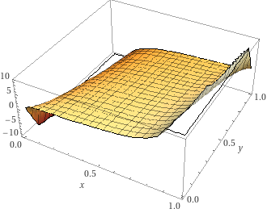
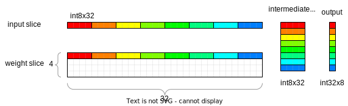

# NNUE

## 前言

本文档包含以下内容：

- 技术性内容
- 对 NNUE 及其原理的详细描述
- 快速的线性代数复习
- 输入定义和因式分解
- 适用于 NNUE 网络的组件（层）
- 推理代码和优化
- 量化数学和实现
- 近乎生产就绪的优化代码
- PyTorch 训练器实现（+ 重要的 CUDA 内核）
- 架构考量和历史

本文档不包含以下内容：

- 训练网络的教程（相关内容请参阅 [wiki](https://github.com/glinscott/nnue-pytorch/wiki)）
- 数据集、优化器、超参数
- 实验结果日志

## 目录

* [前言](#前言)
* [目录](#目录)
* [基础知识](#基础知识)
    + [什么是 NNUE？](#什么是-nnue)
        - [量化 101 及其重要性](#量化-101-及其重要性)
    + [哪些层在 NNUE 中有用？](#哪些层在-nnue-中有用)
        - [线性层](#线性层)
        - [具有稀疏输入的线性层](#具有稀疏输入的线性层)
        - [Clipped ReLU 层](#clipped-relu-层)
        - [Sigmoid](#sigmoid)
        - [Quantmoid4](#quantmoid4)
        - [池化层](#池化层)
    + [一个简单的输入特征集。](#一个简单的输入特征集)
    + [一个简单的 NNUE 网络](#一个简单的-nnue-网络)
    + [网络规模和成本的考量。](#网络规模和成本的考量)
        - [特征集](#特征集)
        - [第一组隐藏神经元](#第一组隐藏神经元)
        - [更深层](#更深层)
    + [累加器](#累加器)
    + [HalfKP](#halfkp)
        - [多视角，多累加器](#多视角-多累加器)
            * [如何组合多个累加器视角？](#如何组合多个累加器视角)
            * [每个视角使用哪组权重？](#每个视角使用哪组权重)
        - [HalfKP 示例和网络图](#halfkp-示例和网络图)
* [前向传播实现](#前向传播实现)
    + [示例网络](#示例网络)
    + [层参数](#层参数)
    + [累加器](#累加器-1)
        - [刷新累加器](#刷新累加器)
        - [更新累加器](#更新累加器)
    + [线性层](#线性层-1)
    + [ClippedReLU](#clippedrelu)
    + [整合](#整合)
* [使用 PyTorch 训练网络](#使用-pytorch-训练网络)
    + [模型规范](#模型规范)
    + [准备输入](#准备输入)
        - [解析训练数据集并将其移至 Python 端](#解析训练数据集并将其移至-python-端)
        - [训练批次结构和通信](#训练批次结构和通信)
    + [特征因式分解](#特征因式分解)
        - [虚拟特征合并](#虚拟特征合并)
        - [其他因子](#其他因子)
            * [“K” 因子](#k-因子)
            * [“HalfRelativeKP” 因子](#halfrelativekp-因子)
        - [因式分解的实际效果](#因式分解的实际效果)
    + [损失函数及其应用](#损失函数及其应用)
        - [目标](#目标)
        - [将评估从 CP 空间转换为 WDL 空间](#将评估从-cp-空间转换为-wdl-空间)
        - [在评估过程中使用结果](#在评估过程中使用结果)
        - [均方误差 (MSE)](#均方误差-mse)
            * [损失](#损失)
            * [梯度](#梯度)
        - [交叉熵](#交叉熵)
            * [损失](#损失-1)
            * [梯度](#梯度-1)
* [量化](#量化)
    + [Stockfish 量化方案](#stockfish-量化方案)
        - [特征转换器](#特征转换器)
        - [线性层](#线性层-2)
        - [ClippedReLU](#clippedrelu-1)
    + [量化的数学原理以及如何使其适用](#量化的数学原理以及如何使其适用)
        - [特征转换器](#特征转换器-1)
        - [线性层](#线性层-3)
    + [实现](#实现)
    + [优化实现](#优化实现)
        - [特征转换器](#特征转换器-2)
        - [线性层](#线性层-4)
            * [m256_add_dpbusd_epi32](#m256_add_dpbusd_epi32)
            * [m256_haddx4](#m256_haddx4)
        - [具有稀疏输入的线性层](#具有稀疏输入的线性层)
            * [m256_process_chunk](#m256_process_chunk)
        - [具有分块稀疏输入的线性层](#具有分块稀疏输入的线性层)
            * [提高几率](#提高几率)
        - [具有稀疏输入的线性层，替代方法](#具有稀疏输入的线性层-替代方法)
            * [m256_process_chunk_alternative](#m256_process_chunk_alternative)
        - [具有稀疏输入和分块稀疏输出的线性层](#具有稀疏输入和分块稀疏输出的线性层)
        - [ClippedReLU](#clippedrelu-2)
            * [int16 -> int8](#int16---int8)
            * [int32 -> int8](#int32---int8)
        - [Quantmoid4](#quantmoid4-1)
        - [池化层](#池化层-1)
            * [平均池化](#平均池化)
            * [最大池化](#最大池化)
            * [乘积池化](#乘积池化)
    + [在训练器中考虑量化](#在训练器中考虑量化)
        - [范围](#范围)
            * [在优化器内部](#在优化器内部)
            * [在优化器外部](#在优化器外部)
            * [考虑虚拟层（因式分解）](#考虑虚拟层-因式分解)
        - [不可微层](#不可微层)
            * [用于训练安全混合 Quantmoid4 的自定义内核](#用于训练安全混合-quantmoid4-的自定义内核)
* [优化训练器 (CUDA)](#优化训练器-cuda)
    + [使用自定义 CUDA 内核](#使用自定义-cuda-内核)
    + [特征转换器](#特征转换器-3)
        - [新数据加载器](#新数据加载器)
        - [特征转换器前向内核](#特征转换器前向内核)
        - [特征转换器后向内核](#特征转换器后向内核)
        - [FeatureTransformerSlice 层](#featuretransformerslice-层)
* [架构和新方向](#架构和新方向)
    + [简单的 HalfKP Stockfish 架构](#简单的-halfkp-stockfish-架构)
    + [HalfKAv2 特征集。](#halfkav2-特征集)
    + [HalfKAv2_hm 特征集。](#halfkav2_hm-特征集)
    + [直接转发到输出的特征转换器的一部分。](#直接转发到输出的特征转换器的一部分)
    + [多个 PSQT 输出和多个子网络](#多个-psqt-输出和多个子网络)
* [历史上的 Stockfish 评估网络架构](#历史上的-stockfish-评估网络架构)
    + [“SFNNv9” 架构](#sfnnv9-架构)
    + [“SFNNv8” 架构](#sfnnv8-架构)
    + [“SFNNv7” 架构](#sfnnv7-架构)
    + [“SFNNv6” 架构](#sfnnv6-架构)
    + [“SFNNv5” 架构](#sfnnv5-架构)
    + [“SFNNv4” 架构](#sfnnv4-架构)
    + [“SFNNv3” 架构](#sfnnv3-架构)
    + [“SFNNv2” 架构](#sfnnv2-架构)
    + [“SFNNv1” 架构](#sfnnv1-架构)

## 基础知识

### 什么是 NNUE？

NNUE（ƎUИИ 高效可更新神经网络）广义上讲是一种神经网络架构，它利用了两次连续评估之间网络输入变化最小的特点。它由  为将棋发明，于 2018 年 5 月集成到由 Motohiro Isozaki 开发的 [YaneuraOu](https://github.com/yaneurao/YaneuraOu) 中，后来于 2019 年 6 月由  移植到国际象棋中用于 Stockfish，但也适用于许多其他棋盘游戏，甚至可能适用于其他领域。NNUE 遵循以下原则：

1. 网络的非零输入量应相对较少。
2. 在随后的评估之间，输入应尽可能少地改变。
3. 网络应足够简单，以便于在整数域中进行低精度推理。

遵循第一个原则意味着当网络规模扩大时，输入必须变得稀疏。当前最佳架构的输入稀疏度约为 0.1%。少量非零输入为必须完整评估网络的情况下的评估时间设置了一个较低的上限。这是 NNUE 网络可以很大但评估速度仍然很快的主要原因。

遵循第二个原则（前提是第一个原则得到遵循）创造了一种有效更新网络（或至少是其中一个昂贵部分）的方法，而不是完全重新评估它。这利用了单步移动仅轻微改变棋盘状态的事实。这比第一个原则的重要性要低，并且对于实现来说是完全可选的，但是，在确实关心利用这一点的实现中，它确实提供了可衡量的改进。

遵循第三个原则可以在通用硬件上实现最高性能，并使模型特别适合于传统国际象棋引擎所必需的低延迟 CPU 推理。

总的来说，NNUE 原则也适用于昂贵的深度网络，但它们在快速的浅层网络中大放异彩，这些网络适合于低延迟 CPU 推理，而无需批处理和加速器。目标性能是每线程每秒百万次评估。这是一个极端的用例，需要极端的解决方案，最重要的是**量化**。

#### 量化 101 及其重要性

量化是将神经网络模型的域从浮点数更改为整数的过程。NNUE 网络旨在在低精度整数域中快速评估，并且可以最大限度地利用现代 CPU 的可用 int8/int16 性能。浮点数不是实现最大引擎强度的选择，因为它为了获得太少的精度增益而牺牲了太多的速度（尽管由于其简单性，一些引擎使用了浮点表示）。量化不可避免地会引入误差，网络越深，误差累积得越多，但是在 NNUE 网络这种相对较浅的情况下，这种误差可以忽略不计。本文档稍后将更详细地描述量化。在此之前，本文档将使用浮点数而不是整数，在我们进行实际代码优化之前，这并不重要。这次插入的目的是让读者意识到 NNUE 的最终目标，因为它是塑造 NNUE 模型并决定什么是可能和什么是不可能的最重要因素。

### 哪些层在 NNUE 中有用？

NNUE 依赖于可以在低精度环境中使用简单算术实现的简单层。这意味着线性（全连接，基本上是矩阵乘法）和 ClippedReLU（clamp(0, 1)）层特别适合它。池化层（乘法/平均/最大）或更复杂激活函数（如 sigmoid）的近似值也适用，但并不常用。

通常，此类网络保持较浅（2-4 层），因为大多数知识都保存在第一层（它利用输入稀疏性来保持性能），并且在第一层之后，网络需要急剧减小其宽度（网络后期较深部分的好处将被大型第一层的影响所主导）以维持性能要求。

#### 线性层

线性（全连接）层只是一个简单的矩阵乘法。它可以高效实现，支持稀疏输入，并提供良好的容量。它以 `in_features` 个值作为输入，并产生 `out_features` 个值。操作为 `y = Ax+b`，其中：

`x` - 大小为 `in_features` 的输入列向量

`A` - 大小为 `(out_features, in_features)` 的权重矩阵

`b` - 大小为 `out_features` 的偏置列向量

`y` - 大小为 `out_features` 的输出列向量


#### 具有稀疏输入的线性层

乘法 `Ax` 在概念上可以简化为“如果 `x[i]` 不为零，则取 `A` 的第 `i` 列，将其乘以 `x[i]` 并将其加到结果中”。现在应该很明显，只要输入的元素为零，我们就可以跳过处理权重矩阵的整个列。这意味着我们只需要处理与输入向量中非零值一样多的 `A` 列。即使权重矩阵中可能有数万列，我们对于每个位置只关心其中的少数几列！这就是为什么第一层可以如此之大的原因。


#### Clipped ReLU 层

这是一种基于普通 ReLU 的激活函数，不同之处在于它在上下都有界。公式为 `y = min(max(x, 0), 1)`。


该层的目的是为网络增加非线性。如果只是线性层，它们都可以折叠成一个，因为矩阵可以简单地相乘。

ClippedReLU 理想情况下会被 ReLU 取代，但激进的量化需要减小隐藏层输入的动态范围，因此将值限制在 1 对于性能变得很重要。

#### Sigmoid

这是一种与 [clipped] ReLU 相反，是平滑的激活函数。公式为 `y = 1/(1+e^-kx)`，其中 k 是一个决定形状“拉伸”程度的参数。


与 Clipped ReLU 相比，主要有两个区别：

1. Sigmoid 是平滑的，这意味着它处处可微，也就是说（实际上）不存在梯度消失的情况。
2. Sigmoid 是非线性的，输出会饱和到 0 或 1，但永远不会达到。

虽然这个函数通常能让网络学到比 ReLU 更多的东西，但它的计算成本很高，不适合在整数域中进行评估。然而，它是一个很好的改进起点……

#### Quantmoid4

由于 Sigmoid 的计算成本太高，我们需要寻找替代方案。其中一种替代方案是使用近似值。碰巧的是，`sigmoid(4x)`（以特定方式缩放到整数域）可以很好地用一个简单的分段二次函数来近似，该函数只需要加法、乘法和位移。由于此近似的主要目的是直接用于量化实现，我们将展示一个特定的变体，其输出值范围为 `[0, 126]`（输入也相应缩放）。选择上限为 126 的原因在于，这是最大的偶数 8 位整数，我们希望它是偶数，以便 `x=0` 时的值恰好在中间。方程如下：


请注意，正负 `x` 的方程几乎相同。这种相似性使得即使存在两种情况，也可以实现无分支的实现。

得到的图形如下（附带一个缩放的 sigmoid(4x) 以供比较）：



缺点是它失去了平滑性，并且输出很早就四舍五入到 0/1。然而，这在实践中似乎不是问题，这种“四舍五入”带来的实际误差可以忽略不计。

一旦我们实现并优化它，就会有更多很酷的东西，所以我们将在优化的量化实现部分回到这个层。

#### 池化层

有时，为了使层的大小更易于处理，需要降低输入维度。例如，与其使用一个输出非常窄的 `1024->8` 层，不如使用 `512->16` 层。池化层可以通过降低维度来提供一些灵活性。

池化层通过在输入的非重叠跨度上应用函数 `F` 来工作，其中 `F` 的输入多于输出。因此，例如，可以让 `F` 接受 2 个连续输入并产生一个输出，从而有效地将神经元数量减半。

可以考虑以下类型的池化层：

1. 平均池化 - 输出输入的平均值。适用于任意数量的输入。
2. 最大池化 - 输出输入的最大值。适用于任意数量的输入。
3. 乘积池化 - 输出输入的乘积。由 Stockfish 引入，在通用机器学习中不常见。仅适用于 2 个输入。这个似乎也具有与 Sigmoid (Quantmoid4) 相似的好处；它增加了网络的容量，而其他池化层仅允许降低维度。

### 一个简单的输入特征集。

为了便于说明，我们将考虑一个基于棋子位置的简单输入集。我们称之为“A”特征，因为它们将代表“所有棋子”。

棋盘上有 64 个方格，6 种棋子类型（兵、马、象、车、后、王）和 2 种颜色（白、黑）。我们想要编码为输入的是棋子的位置，因此每个输入将对应于某个（方格、棋子类型、颜色）元组。共有 `64*6*2=768` 个这样的元组。如果方格 `S` 上有一个颜色为 `C` 的棋子 `P`，我们将输入 `(S, P, C)` 设置为 1，否则设置为 0。尽管输入总数为 768，但在任何给定的合法国际象棋局面中，最多只能有 32 个非零输入，因为棋盘上最多只有 32 个棋子。此外，任何一步棋最多只能改变 4 个输入（王车易位），平均值应低于 3。

在将特征传递给神经网络时，利用了输入的二进制和稀疏性——输入只是特征（索引）的列表，不需要完整的输入向量，因为其他位置的值为 0，我们知道每个活动特征都有一个与之关联的值 1。

让我们看一个例子局面 `1k6/8/8/8/3r4/2P5/8/K7 w - - 0 1`。


在上面的棋盘上，我们有 4 个活动特征：`(A1, 王, 白)`, `(C3, 兵, 白)`, `(B8, 王, 黑)`, `(D4, 车, 黑)`。

现在让我们考虑 c4 这一步——唯一失效的特征是 `(C3, 兵, 白)`，它需要被替换为 `(C4, 兵, 白)`。

现在让我们考虑 cxd4 这一步——兵移动了，所以像以前一样，我们移除 `(C3, 兵, 白)` 并添加 `(D4, 兵, 白)`。但车也被从棋盘上移除了，所以我们还必须移除 `(D4, 车, 黑)`。这仍然比从头开始重新创建输入的工作量要少！

### 一个简单的 NNUE 网络

我们将使用上一段中的“A”特征集，因此我们有 768 个输入。为了便于说明，这些层将是 3 个线性层，768->8、8->8、8->1。所有层都是线性的，所有隐藏神经元都使用 ClippedReLU 激活函数。下图说明了该架构：

![A[768]->8->8->1 架构图](img/A-768-8-8-1.svg)

流程从左到右。第一层是一个大型全连接层，有 768 个输入，但对于每个局面，只有一小部分是非零的——可以利用稀疏矩阵-向量乘法。隐藏层要小得多，并且总是使用密集矩阵-向量乘法计算。最后，我们得到 1 个输出，通常被训练为局面的百分位评估（或与之成比例）。

### 网络规模和成本的考量。

选择正确的架构很棘手，因为这是一个准确性/性能的权衡。大型网络提供更准确的评估，但速度影响可能会完全抵消实际对局中的收益。例如，Stockfish 慢慢地从 `256x2->32->32->1` 过渡到 `1024x2->8->32->1`。

#### 特征集

在选择特征集时，可能会倾向于使用复杂的领域特定知识，但相关的成本使得更简单的解决方案更具吸引力。HalfKP，稍后将详细解释，非常简单、快速且足够好。已经尝试过更复杂的特征集，但它们通常无法克服性能上的损失。HalfKP 特征易于计算，并且每个局面之间的变化很小。

还必须考虑大小。对于 `256x2->32->32->1` 架构，HalfKP 输入在第一层需要大约 1000 万个参数，量化后相当于 20MB。对于某些用户来说，拥有一个非常大的特征集，可能包含数亿个参数，可能不是问题，但对于普通用户来说，这很不方便。此外，增加特征集大小可能会降低某些实现的训练速度，并且肯定需要更多时间才能收敛。

#### 第一组隐藏神经元

第一层中的输出数量是最关键的参数，对速度和大小的影响也最大。与此参数相关的成本是双重的。一方面，它增加了更新累加器时所需的操作数量。另一方面，对于优化的实现，必须考虑可用寄存器的数量——在 Stockfish 中，超过 256 个神经元需要多次遍历特征索引，因为 AVX2 没有足够的寄存器。它还部分决定了第一个密集线性层的大小，这也极大地影响了总成本。

#### 更深层

与机器学习中考虑的典型网络不同，这里的大部分知识都存储在第一层，因此在输出附近添加更多的小层对准确性的提升很小，如果采用量化，由于误差累积，甚至可能有害。NNUE 网络保持异常浅，并且保持后期层的大小较小可以提高性能。

### 累加器

> 将全量计算转变为增量更新，减少计算次数
> 使用浮点数时，计算不是反复加减，因为会带来误差累积；而是保存当前状态再恢复
> 量化为整数时，需要避免整数溢出问题

尽管我们观察到每个局面之间只有很少的输入发生变化，但我们尚未利用这一点。回想一下，线性层只是将一些权重矩阵列相加。与其为每个局面重新计算第一组隐藏神经元，我们可以将它们作为局面状态的一部分保留，并在每次移动时根据添加或删除了哪些特征（列）来更新它！我们只需要处理两种简单的情况：

1. 特征 `i` 从输入中移除 (1 -> 0) - 从累加器中减去权重矩阵的第 `i` 列
2. 特征 `i` 添加到输入中 (0 -> 1) - 将权重矩阵的第 `i` 列添加到累加器中

对于单步移动，很容易找到哪些“A”特征发生了变化——我们知道我们正在移动哪个棋子，从哪里移动，以及移动到哪里。吃子和升变可以被认为是棋子从无到有或从有到无。

然而，在使用浮点值时必须小心。重复加减浮点数会导致误差，并且每次移动都会累积。需要仔细评估误差是否足够小，以使网络仍然能产生好的结果。值得庆幸的是，最好的实现方式是，在撤销移动时不会更新累加器。相反，它只是存储在搜索堆栈上，因此误差受 `O(MAX_DEPTH)` 的限制，并且基本上可以忽略。

使用量化时，这不再是问题，增量实现是一致的，但现在存在累加器溢出的可能性（无论是否使用增量更新）。必须选择量化方案，以使任何可能的活动特征组合都不会超过最大值。

### HalfKP

HalfKP 是最常见的特征集，其他成功的特征集都建立在它的基础上。它恰好处于一个最佳位置，大小适中，并且平均每次移动需要很少的更新。每个特征都是一个元组 `(我方王所在位置, 棋子所在位置, 棋子类型, 棋子颜色)`，其中 `棋子类型` 不是王（在 HalfKA 特征集中包含王）。这意味着对于每个王的位置，都有一组特征 `P`，即 `(棋子所在位置, 棋子类型, 棋子颜色)`。这使得网络能够更好地理解与王相关的棋子。特征总数为 `64*64*5*2=40960`。（请注意，当前的 Stockfish 实现中存在将棋的遗留问题，还有 64 个未使用的附加特征，但我们在本文档中将忽略它们）。特征索引可以计算为
```cpp
p_idx = piece_type * 2 + piece_color
halfkp_idx = piece_square + (p_idx + king_square * 10) * 64
```
需要处理的一个特殊情况是王移动时，因为它与所有特征都相关。所有特征都会改变，因此会执行累加器刷新。这使得王移动的成本更高，但平均而言，每次评估的更新次数仍然很低。

现在，你可能会问，“但是哪个王？！”。答案是两个……

#### 多视角，多累加器

在这里，我们需要开始分别考虑双方的特征。白方将保留自己的累加器，黑方也将保留自己的累加器。实际上，这意味着最大活动特征数是只有一个视角的简单特征集的两倍。更新次数将是两倍，累加器总大小也将是两倍，但总的来说，这种速度和准确性之间的权衡是值得的。这种方法不可避免地会带来一些关于确切模型拓扑的问题、选项和选择。让我们逐一解读它们。

##### 如何组合多个累加器视角？

既然我们现在有两个累加器，我们需要以某种方式将它们组合成一个向量，然后传递到网络的更深处。这可以通过两种（三种）方式解决。让我们将白方的累加器表示为 `A_w`，黑方的累加器表示为 `A_b`。

1. 连接 `A_w` 和 `A_b`，将 `A_w` 放在前面，`A_b` 放在后面。这是最简单的选项。在这种情况下，输出始终相对于白方的视角。
2. 连接 `A_w` 和 `A_b`，如果轮到白方走，则将 `A_w` 放在前面，否则将 `A_b` 放在前面，另一个累加器放在后面。这种方法的优点是网络可以学习节奏。它现在知道轮到谁走，这在国际象棋中是一个重要因素，并且可以对某些局面的评估产生巨大影响。在这种情况下，输出始终相对于走棋方的视角。
3. 1 或 2，但不是连接，而是交错。所以 `A_w[0], A_b[0], A_w[1], A_b[1], ...`。这在某些奇异的架构中可能是有利的，在这些架构中，并不总是使用整个组合的累加器，在这种情况下，交错意味着所使用的切片始终包含来自白方和黑方视角的相同数量的输出。例如，当对第一个隐藏层采用结构化稀疏性时，这可能会变得有用，该层最终作用于累加器的子集。

##### 每个视角使用哪组权重？

所以我们为白方和黑方计算相同的特征，它们的权重是否相关？它们可以相关，但不是必需的。引擎在处理这个问题上有所不同。

1. 两个视角使用相同的权重。这意味着棋盘状态需要以某种方式进行定向。否则，E1 上的白王会产生与 E8 上的黑王不同的特征子集，而 G4 上的白王会产生与 G4 上的黑王相同的特征子集。这很糟糕。解决方案是镜像局面并交换黑方视角的棋子颜色；然后，棋子位置到特征的映射对于双方都是合乎逻辑的。从白方视角看，E1 上的白王应该与从黑方视角看 E8 上的黑王相同。现在你可能认为翻转是可行的方法，但虽然国际象棋具有垂直对称性，但将棋具有旋转对称性。Stockfish 中 HalfKP 的最初实现使用旋转来改变视角，这对于国际象棋来说可以说是错误的，但它出人意料地效果很好。
2. 不同视角使用不同的权重。E1 上的白王真的等于 E8 上的黑王吗？其他棋子呢？可以说，与白方相比，作为黑方下棋的方式不同，因此为这些视角使用不同的特征似乎是有道理的。一些引擎就是这样做的，这没有任何问题。唯一的缺点是更大的尺寸和稍长的训练时间，但除此之外，它甚至可能更好！它还完全消除了关于翻转或旋转的讨论，这使得实现更简单。

#### HalfKP 示例和网络图

与上面“A”特征集的图表类似，这里是同一网络但使用 HalfKP 特征集的图表，权重组合在一起。有一个变化是两个累加器的大小都是 4，所以网络最终是 `HalfKP[40960]->4x2->8->1`

让我们看和之前一样的例子局面：`1k6/8/8/8/3r4/2P5/8/K7 w - - 0 1`。


现在我们有两个视角，并将分别列出它们的特征。记住特征是 `(我方王所在位置, 棋子所在位置, 棋子类型, 棋子颜色)`，我们使用翻转来定向黑方的方格，并且颜色是反转的！（可以认为“颜色”是“我方”或“对方”）

白方视角：`(A1, C3, 兵, 白)`, `(A1, D4, 车, 黑)`

黑方视角：`(B1, C6, 兵, 黑)`, `(B1, D5, 车, 白)`

网络图现在看起来更有趣了。

![HalfKP[40960]->4x2->8->1](img/HalfKP-40960-4x2-8-1.svg)

## 前向传播实现

在这一部分，我们将研究模型推理，因为它可以实现在一个简单的国际象棋引擎中。为简单起见，我们将使用浮点值。输入生成超出了本实现的范围。

### 示例网络

我们将采用一个更通用的网络，其架构为 `FeatureSet[N]->M*2->K->1`。因此，各层将是：

1. `L_0`：线性 `N->M`
2. `C_0`：大小为 `M*2` 的 Clipped ReLU
3. `L_1`：线性 `M*2->K`
4. `C_1`：大小为 `K` 的 Clipped ReLU
5. `L_2`：线性 `K->1`

### 层参数

线性层有两个参数——权重和偏置。我们将分别称之为 `L_0.weight` 和 `L_0.bias`。这些层还包含输入和输出的数量，分别在 `L_0.num_inputs` 和 `L_0.num_outputs` 中。

这里必须说明一下权重矩阵的布局。对于稀疏乘法，列主序（一列在内存中是连续的）布局是有利的，因为我们正在对列进行相加，但对于密集乘法，这并不那么明确，行主序布局可能更可取。目前，我们将坚持使用列主序布局，但在涉及量化和优化时，我们可能会重新考虑行主序布局。目前，我们假设 `L_0.weight` 允许以下列形式访问单个元素：`L_0.weight[column_index][row_index]`。

所呈现的代码非常接近 C++，但可能会省略技术细节。

### 累加器

累加器可以由一个数组表示，该数组与搜索堆栈上的其他局面状态信息一起存储。

```cpp
struct NnueAccumulator {
    // 两个大小为 M 的向量。v[0] 用于白方视角，v[1] 用于黑方视角。
    float v[2][M];

    // 这将在后面的代码片段中用于使访问不那么冗长
    float* operator[](Color perspective) {
        return v[perspective];
    }
};
```

累加器可以在评估时延迟更新，也可以在每次移动时更新。在这里这无关紧要，但它必须以*某种方式*更新。是延迟更新还是主动更新更好，取决于搜索期间完成的评估次数。对于更新，有两种情况，如前所述：

1. 累加器必须从头开始重新计算。
2. 重用先前的累加器，仅使用更改的特征进行更新

#### 刷新累加器

```cpp
void refresh_accumulator(
    const LinearLayer&      layer,            // 这将始终是 L_0
    NnueAccumulator&        new_acc,          // 结果的存储
    const std::vector<int>& active_features,  // 此局面活动的特征索引
    Color                   perspective       // 要刷新的视角
) {
    // 首先我们复制层偏置，这是我们的起点
    for (int i = 0; i < M; ++i) {
        new_acc[perspective][i] = layer.bias[i];
    }
    // 然后我们只需累加活动特征的所有列。这就是累加器的作用！
    for (int a : active_features) {
        for (int i = 0; i < M; ++i) {
            new_acc[perspective][i] += layer.weight[a][i];
        }
    }
}
```

#### 更新累加器

```cpp
void update_accumulator(
    const LinearLayer&      layer,            // 这将始终是 L_0
    NnueAccumulator&        new_acc,          // 最好已经为新累加器提供了存储空间。
                                              // 相关部分将被覆盖
    const NNueAccumulator&  prev_acc,         // 我们正在重用的前一个累加器
    const std::vector<int>& removed_features, // 被移除的特征的索引
    const std::vector<int>& added_features,   // 被添加的特征的索引
    Color                   perspective       // 要更新的视角，记住我们有两个，
                                              // 它们有独立的特征列表，甚至可能发生
                                              // 一个被更新而另一个需要完全刷新的情况
) {
    // 首先我们复制之前的值，这是我们的起点
    for (int i = 0; i < M; ++i) {
        new_acc[perspective][i] = prev_acc[perspective][i];
    }

    // 然后我们减去被移除特征的权重
    for (int r : removed_features) {
        for (int i = 0; i < M; ++i) {
            // 只需减去第 r 列
            new_acc[perspective][i] -= layer.weight[r][i];
        }
    }

    // 对于添加的特征也类似，但用加法代替减法
    for (int a : added_features) {
        for (int i = 0; i < M; ++i) {
            new_acc[perspective][i] += layer.weight[a][i];
        }
    }
}
```

就是这样！很简单，不是吗？

### 线性层

这只是简单的向量-矩阵乘法，你可能会问这有什么复杂的？现在没有，但一旦开始优化，它就会变得复杂。现在我们不进行优化，但我们至少会编写一个利用权重矩阵具有列主序布局的版本。

```cpp
float* linear(
    const LinearLayer& layer,  // 要使用的层。我们有两个：L_1, L_2
    float*             output, // 已经为结果分配的存储空间
    const float*       input   // 输入，即前一个 ClippedReLU 层的输出
) {
    // 首先将偏置复制到输出。我们将在此基础上添加列。
    for (int i = 0; i < layer.num_outputs; ++i) {
        output[i] = layer.bias[i];
    }

    // 还记得很久以前那个彩虹色的图表吗？就是这个。
    // 我们正在逐列添加，并按输入值进行缩放。
    for (int i = 0; i < layer.num_inputs; ++i) {
        for (int j = 0; j < layer.num_outputs; ++j) {
            output[j] += input[i] * layer.weight[i][j];
        }
    }

    // 让调用者知道已用缓冲区的结束位置。
    return output + layer.num_outputs;
}
```

### ClippedReLU

```cpp
float* crelu(,
    int          size,   // 无需任何层结构，我们只需要元素数量
    float*       output, // 已经为结果分配的存储空间
    const float* input   // 输入，即前一个线性层的输出
) {
    for (int i = 0; i < size; ++i) {
        output[i] = min(max(input[i], 0), 1);
    }

    return output + size;
}
```

### 整合

用粗略的伪代码表示。特征索引的生成留给读者作为练习。

```cpp
void Position::do_move(...) {
    ... // 执行移动操作

    for (Color perspective : { WHITE, BLACK }) {
        if (needs_refresh[perspective]) {
            refresh_accumulator(
                L_0,
                this->accumulator,
                this->get_active_features(perspective),
                perspective
            );
        } else {
            update_accumulator(
                L_0,
                this->accumulator,
                this->get_previous_position()->accumulator,
                this->get_removed_features(perspective),
                this->get_added_features(perspective),
                perspective
            );
        }
    }
}

float nnue_evaluate(const Position& pos) {
    float buffer[...]; // 为结果分配足够的空间

    // 我们需要先准备输入！我们将把走棋方的累加器放在前面，
    // 另一个放在后面。
    float input[2*M];
    Color stm = pos.side_to_move;
    for (int i = 0; i < M; ++i) {
        input[  i] = pos.accumulator[ stm][i];
        input[M+i] = pos.accumulator[!stm][i];
    }

    float* curr_output = buffer;
    float* curr_input = input;
    float* next_output;

    // 评估一层并将输入和输出都向前移动。
    // 最后一个输出成为下一个输入。
    next_output = crelu(2 * L_0.num_outputs, curr_output, curr_input);
    curr_input = curr_output;
    curr_output = next_output;

    next_output = linear(L_1, curr_output, curr_input);
    curr_input = curr_output;
    curr_output = next_output;

    next_output = crelu(L_1.num_outputs, curr_output, curr_input);
    curr_input = curr_output;
    curr_output = next_output;

    next_output = linear(L_2, curr_output, curr_input);

    // 我们完成了。最后一层应该在 *curr_output 下输出了 1 个值。
    return *curr_output;
}
```

就是这样！这就是整个网络。你说你不能用它是什么意思？！哦，对了，你没有训练好的网络，真扫兴。

## 使用 PyTorch 训练网络

这将非常简短，因为毕竟这是在 nnue-pytorch 仓库中，所以你可以直接查看代码！我们不会解释 PyTorch 是如何工作的，但是，我们会解释一些基础知识，以及为适应这个奇异用例所需的怪癖。

让我们继续使用前向传播实现中的架构。

### 模型规范

PyTorch 有内置的线性层类型，所以定义模型非常简单。

```python
class NNUE(nn.Module):
    def __init__(self):
        super(NNUE, self).__init__()

        self.ft = nn.Linear(NUM_FEATURES, M)
        self.l1 = nn.Linear(2 * M, N)
        self.l2 = nn.Linear(N, K)

    # 输入是一个完整的批次！
    # `stm` 表示白方是否是走棋方。1 = 是，0 = 否。
    def forward(self, white_features, black_features, stm):
        w = self.ft(white_features) # 白方视角
        b = self.ft(black_features) # 黑方视角

        # 记住，我们根据谁走棋来排列两个视角的累加器。
        # 所以我们通过在 `stm` 和 `1-stm` 张量之间进行插值来混合两种可能的排序。
        accumulator = (stm * torch.cat([w, b], dim=1)) + ((1 - stm) * torch.cat([b, w], dim=1))

        # 运行线性层并使用 clamp_ 作为 ClippedReLU
        l1_x = torch.clamp(accumulator, 0.0, 1.0)
        l2_x = torch.clamp(self.l1(l1_x), 0.0, 1.0)
        return self.l2(l2_x)
```

值得庆幸的是，PyTorch 通过自动微分自动处理反向传播。真棒！现在困难的部分，也许令人惊讶的是，是提供数据。

### 准备输入

这部分有两个主要瓶颈。
1. 解析训练数据集
2. 准备张量输入

#### 解析训练数据集并将其移至 Python 端

你可能会想用 Python 来实现这个。这会起作用，但遗憾的是，速度会慢几个数量级。我们在 nnue-pytorch 中所做的是，我们用 C++ 创建了一个共享库，它实现了一个非常快的训练数据解析器，并以可以快速转换为输入张量的形式提供数据。

我们将使用 [Ctypes](https://docs.python.org/3/library/ctypes.html) 在 C 和 Python 之间进行互操作。例如，如果你想要更多示例，[Seer 的训练器](https://github.com/connormcmonigle/seer-training/tree/6077a044c596963a34c504df8450aceaaa2b3fb1) 使用了 pybind11。实际上，任何提供从 Python 传递指针和调用 C 函数的方法都可以。也可以使用其他语言，但请记住，只有 C 具有稳定的 ABI，这使得事情更容易、更具可移植性。因此，例如，如果你想使用 C++（就像我们在这里一样），将导出的函数标记为 `extern "C"` 很重要。

数据读取器在创建时被传递一个文件，然后它会生成所请求数量的工作线程，这些线程会处理数据并异步准备**整个批次**。然后将批次传递到 Python 端并转换为 PyTorch 张量。一次处理一个样本不是一个可行的选择，需要通过生成整个批次来走捷径。你可能会问为什么。PyTorch 可以将多个张量转换为一个批次，那么问题出在哪里？让我们看看……

还记得输入是稀疏的吗？现在假设我们的批次大小是 8192。如果我们发送 8192 个稀疏张量并尝试从中形成一个批次，会发生什么？嗯，PyTorch 本身不喜欢这样做，我们需要帮助它。最好的方法是形成一个包含整个批次的大型 2D 稀疏输入张量。它有两个稀疏维度，索引是 `(position_index, feature_index)`，非常简单，性能很好，而且不需要创建临时张量！我们从一开始就形成整个批次的事实也意味着我们可以减少分配次数并为批次部分使用更好的内存布局。

因此，我们也不能简单地使用 PyTorch 的 `DataLoader`，而是需要将其用作一个单纯的包装器。但这种努力是值得的。一个工作线程通常可以毫无问题地饱和即使是高端 GPU。

#### 训练批次结构和通信

最少需要的是特征（来自两个视角）、走棋方（用于累加器切片排序）和局面评估（分数）。让我们看看如何表示这样一个批次。

```cpp
struct SparseBatch {
    SparseBatch(const std::vector<TrainingDataEntry>& entries) {

        // 批次中的局面数量
        size = entries.size();

        // 整个批次中白色/黑色活动特征的总数。
        num_active_white_features = 0;
        num_active_black_features = 0;

        // 每个局面的走棋方。1 表示白色，0 表示黑色。
        // 在前向传播中对累加器切片进行排序时需要。
        stm = new float[size];

        // 每个局面的分数。这是我们将要教给网络的值。
        score = new float[size];

        // 活动特征的索引。
        // 为什么大小是 * 2？！答案是索引是二维的
        // (position_index, feature_index)。它实际上是一个大小为
        // (num_active_*_features, 2) 的矩阵。
        // 重要提示：我们必须确保索引按升序排列。
        // 也就是说，首先是第一个局面，然后是第二个，然后是第三个，
        // 依此类推。在一个局面的特征中，特征索引
        // 也按升序排列。为什么需要这样做，稍后会很明显。
        white_features_indices = new int[size * MAX_ACTIVE_FEATURES * 2];
        black_features_indices = new int[size * MAX_ACTIVE_FEATURES * 2];

        fill(entries);
    }

    void fill(const std::vector<TrainingDataEntry>& entries) {
        ...
    }

    int size;
    int num_active_white_features;
    int num_active_black_features;

    float* stm;
    float* score;
    int* white_features_indices;
    int* black_features_indices;

    ~SparseBatch()
    {
        // RAII！或者使用 std::unique_ptr<T[]>，但请记住，只有原始指针应该
        // 通过语言边界传递，因为 std::unique_ptr 没有稳定的 ABI
        delete[] stm;
        delete[] score;
        delete[] white_features_indices;
        delete[] black_features_indices;
    }
};
```

在 Python 中

```python
class SparseBatch(ctypes.Structure):
    _fields_ = [
        ('size', ctypes.c_int),
        ('num_active_white_features', ctypes.c_int),
        ('num_active_black_features', ctypes.c_int),
        ('stm', ctypes.POINTER(ctypes.c_float)),
        ('score', ctypes.POINTER(ctypes.c_float)),
        ('white_features_indices', ctypes.POINTER(ctypes.c_int)),
        ('black_features_indices', ctypes.POINTER(ctypes.c_int))
    ]

    def get_tensors(self, device):
        # 这只是说明性的。实际上，你可能需要将这些
        # 传输到 GPU。你也可以异步执行此操作，但请记住
        # 确保源的生命周期足够长，以便复制完成。
        # 有关更多信息，请参阅 torch.tensor.to(...)。

        # 这是将指针转换为 PyTorch 张量的好方法。
        # 需要传递形状，记住我们正在形成整个批次，第一个
        # 维度始终是批次大小。
        stm_t = torch.from_numpy(
            np.ctypeslib.as_array(self.stm, shape=(self.size, 1)))
        score_t = torch.from_numpy(
            np.ctypeslib.as_array(self.score, shape=(self.size, 1)))

        # 正如我们所说，索引张量需要转置（而不是整个稀疏张量！）。
        # 这只是 PyTorch 在稀疏张量中存储索引的方式。
        # 它还要求索引是 64 位整数。
        white_features_indices_t = torch.transpose(
            torch.from_numpy(
                np.ctypeslib.as_array(self.white_features_indices, shape=(self.num_active_white_features, 2))
            ), 0, 1).long()
        black_features_indices_t = torch.transpose(
            torch.from_numpy(
                np.ctypeslib.as_array(self.black_features_indices, shape=(self.num_active_white_features, 2))
            ), 0, 1).long()

        # 值都是 1，所以我们可以轻松地就地创建这些张量。
        # 无需通过复制。
        white_features_values_t = torch.ones(self.num_active_white_features)
        black_features_values_t = torch.ones(self.num_active_black_features)

        # 现在是神奇的时刻。我们通过给出非零值的索引（活动特征索引）
        # 和值本身（都是 1！）来构造一个稀疏张量。
        # 张量的大小是 batch_size*NUM_FEATURES，这通常
        # 会非常大，但由于密度约为 0.1%，它占用的空间
        # 非常小，并允许更快的正向传播。
        # 为了获得最佳性能，我们确实作弊了。通常 PyTorch
        # 会检查正确性，这是一个昂贵的 O(n) 操作。
        # 通过使用 _sparse_coo_tensor_unsafe，我们避免了这种情况。
        white_features_t = torch._sparse_coo_tensor_unsafe(
            white_features_indices_t, white_features_values_t, (self.size, NUM_FEATURES))
        black_features_t = torch._sparse_coo_tensor_unsafe(
            black_features_indices_t, black_features_values_t, (self.size, NUM_FEATURES))

        # 什么是合并？！它确保索引是唯一的和有序的。
        # 现在你可能明白为什么我们说输入必须从一开始就排序了。
        # 这通常是一个 O(n log n) 的操作，需要大量的时间。
        # 但在这里，我们**知道**张量已经处于合并形式，
        # 因此我们可以告诉 PyTorch 它可以使用这个假设。
        white_features_t._coalesced_(True)
        black_features_t._coalesced_(True)

        # 现在这就是 forward() 所需要的！
        return white_features_t, black_features_t, stm_t, score_t

# 让我们也告诉 ctypes 如何理解这个类型。
SparseBatchPtr = ctypes.POINTER(SparseBatch)
```

### 特征因式分解

让我们再次关注特征。我们将更仔细地研究 `HalfKP` 特征集。回想一下，`HalfKP` 特征由 `(king_square, piece_square, piece_type, piece_color)` 形式的元组索引，其中 `piece_type != KING`。

`HalfKP` 特征集是通过将 `P` 特征集针对棋盘上的每个王方格进行特化而形成的。这反过来又增加了特征集的大小，并导致访问变得更加稀疏。这种稀疏性直接影响每个特征在训练期间被看到的频率，从而对权重的学习产生负面影响。

特征因式分解在训练期间有效且高效地将特征关联在一起，以便在训练的每个步骤中影响更多的特征。这在训练的早期阶段尤其重要，因为它甚至可以使最稀有的特征权重也能快速填充合理的值。

特征因式分解通过引入一个“虚拟”特征集（相对于“真实”特征集，此处为 `HalfKP`）来工作，该特征集包含更密集的特征，每个特征都与一个或多个“真实”特征直接相关（并且重要的是，是冗余的）。这些“虚拟”特征仅在训练过程中存在，并将学习它们所关联的所有“真实”特征的共同因素。让我们看看它在 `HalfKP` 的情况下是如何工作的。

如前所述，`HalfKP` 只是 `P` 重复 64 次，每个王方格一次。因此，每个 `P` 特征都与 64 个 `HalfKP` 特征相关，并将学习所有可能的王位置的 `(piece_square, piece_type, piece_color)` 特征的共同因素。

因为“虚拟”特征与“真实”特征是冗余的，所以它们的权重可以在训练完成后合并到“真实”特征的权重中。合并它们的方式源于网络层（特征转换器）中执行的计算。

#### 虚拟特征合并

那么我们如何合并它们呢？让我们再看一下矩阵和向量乘法是如何完成的。考虑之前的示例局面 (`1k6/8/8/8/3r4/2P5/8/K7 w - - 0 1`)。

:

让我们关注特征 `(A1, C3, 兵, 白)`。现在，我们还要添加相应的 `P` 特征 `(C3, 兵, 白)`。当输入通过第一层时会发生什么？

```cpp
accumulator += weights[(A1, C3, pawn, white)];
accumulator += weights[(C3, pawn, white)];
```

这等价于

```cpp
accumulator += weights[(A1, C3, pawn, white)] + weights[(C3, pawn, white)];
```

所以关系非常简单。我们只需要将每个 `P` 特征的权重添加到所有相关的 `HalfKP` 特征权重中！

#### 其他因素

有时可以添加更多的因素。但是，应该注意的是，仅仅添加更多的因素并不一定会改善训练，甚至可能导致其倒退。总的来说，使用某些因素是否有帮助取决于训练设置和正在训练的网络。尝试这些东西总是好的。话虽如此，但是，我们可以考虑例如 `HalfKP` 的以下因素。

##### “K” 因素

王的位置，64 个特征。这个需要一些仔细的处理，因为单个局面多次具有此特征——等于棋盘上的棋子数量。这个虚拟特征集纯粹是因为 HalfKP 没有在任何地方编码王的位置特征。例如，HalfKA 不需要它，因为它专门具有王的位置特征。总的来说，处理这个问题很棘手，甚至可能需要减少这些特征的梯度（否则梯度是 `input*weight`，但与其他特征相比，输入很大）。

##### “HalfRelativeKP” 因素

在 `HalfKP` 中，我们使用绝对棋子位置，但是如果我们将位置编码为相对于王的位置呢？有 15x15 个这样的相对位置是可能的，其中大多数与某些 `HalfKP` 特征是 1:many 的关系。例如，可以像这样计算 HalfRelativeKP 特征索引：
```cpp
int get_half_relative_kp_index(Color perspective, Square king_sq, Square piece_sq, Piece piece)
{
    const int p_idx = static_cast<int>(piece.type()) * 2 + (piece.color() != perspective);
    const Square oriented_king_sq = orient_flip(perspective, king_sq);
    const Square oriented_piece_sq = orient_flip(perspective, piece_sq);
    // 文件/列的差异始终在 -7..7 范围内，我们需要将其映射到 0..15
    const int relative_file = oriented_piece_sq.file() - oriented_king_sq.file() + 7;
    const int relative_rank = oriented_piece_sq.rank() - oriented_king_sq.rank() + 7;
    return (p_idx * 15 * 15) + (relative_file * 15) + relative_rank;
}
```

#### 因式分解的实际效果

虽然因式分解有助于网络泛化，但它似乎只在早期阶段相关，即当网络还一无所知时。它加速了训练的早期阶段，并降低了输入的稀疏性（否则某些输入非常罕见）。但它很快变得不重要，在训练的后期阶段可以将其移除以提高一些训练速度（毕竟它可以添加很多活动特征）。

### 损失函数及其应用

#### 目标

训练网络实际上只是最小化一个损失函数，该函数需要是平滑的，并且在“最优”评估（训练目标）处具有最小值。对于 NNUE，这是通过梯度下降法通过通常的机器学习方法完成的（也有此处未描述的非梯度方法）。

#### 将评估从 CP 空间转换为 WDL 空间

CP 空间是指百分位兵值（或与之成比例的东西，如引擎的内部单位）。WDL 空间是指 0=负、0.5=和、1=胜。

当然可以直接在评估值（在 CP 空间中）上应用损失函数，但这可能导致梯度过大（或大量的超参数调整），限制了可用的损失函数集，并且不允许使用结果来计算损失。我们将专注于 WDL 空间中的评估。但是如何在这些空间之间进行转换呢？通常，评估与性能的对应关系可以通过 Sigmoid 函数很好地拟合。例如，在 Stockfish 生成的一些数据中，我们有：


所以在代码中我们可以这样做：
```python
scaling_factor = 410 # 这取决于引擎，甚至可能取决于数据
wdl_space_eval = torch.sigmoid(cp_space_eval / scaling_factor)
```

这种转换还有一个很好的效果，即大的评估值变得“更接近”，这与实际对局非常吻合，在实际对局中，大的评估值不需要那么精确。

#### 在评估过程中使用结果

由于我们将计算损失的值置于 WDL 空间中，我们现在可以用对局结果来插值它们。我们将引入一个 `lambda_` 参数来控制插值。
```python
# game_result 在 WDL 空间中
wdl_value = lambda_ * wdl_space_eval + (1 - lambda_) * game_result
```

插值也可以应用于损失。
```python
loss_eval = ... # 模型评估和局面评估之间的损失
loss_result = ... # 模型评估和对局结果之间的损失
loss = lambda_ * loss_eval + (1 - lambda_) * loss_result
```

哪种方式效果更好取决于你的情况 :)

#### 均方误差 (MSE)

现在我们知道我们要拟合什么了；让我们看看我们将如何拟合它们。

这是一个非常简单的损失函数，它只取预测值和目标值之间差值的平方。这会产生一个很好的线性梯度。

在之前应用插值：
```python
scaling = ... # 取决于引擎和数据。决定了将评估转换为 WDL 空间的
              # Sigmoid 函数的形状
              # Stockfish 使用 400 左右的值
wdl_eval_model = sigmoid(model(...) / scaling)
wdl_eval_target = sigmoid(target / scaling)
wdl_value_target = lambda_ * wdl_eval_target + (1 - lambda_) * game_result
loss = (wdl_eval_model - wdl_value_target)**2
```

在之后应用插值：
```python
scaling = ...
wdl_eval_model = sigmoid(model(...) / scaling)
wdl_eval_target = sigmoid(target / scaling)
loss_eval   = (wdl_eval_model - wdl_eval_target)**2
loss_result = (wdl_eval_model - game_result)**2
loss = lambda_ * loss_eval + (1 - lambda_) * loss_result
```

注意：在实践中，指数可以 >2。更高的指数以牺牲准确性为代价，更注重精度。例如，Stockfish 网络在使用 2.6 的指数时取得了良好的训练结果。

##### 损失


##### 梯度


#### 交叉熵

这个损失函数通常用于连续分类问题，我们的用例可以被认为是一个。

在域边界附近必须小心。通常，会添加一个非常小的值 (epsilon)，以使值在对数下永远不会达到 0。

在之前应用插值：
```python
epsilon = 1e-12 # 防止 log(0)
scaling = ...
wdl_eval_model = sigmoid(model(...) / scaling)
wdl_eval_target = sigmoid(target / scaling)
wdl_value_target = lambda_ * wdl_eval_target + (1 - lambda_) * game_result

# 损失中的第一项梯度为 0，因为我们总是
# 对 `wdl_eval_model` 求导，但这使得损失很好
# 在某种意义上，0 是最小值。
loss = (wdl_value_target * log(wdl_value_target + epsilon) + (1 - wdl_value_target) * log(1 - wdl_value_target + epsilon))
      -(wdl_value_target * log(wdl_eval_model   + epsilon) + (1 - wdl_value_target) * log(1 - wdl_eval_model   + epsilon))
```

在之后应用插值：
```python
epsilon = 1e-12 # 防止 log(0)
scaling = ...
wdl_eval_model = sigmoid(model(...) / scaling)
wdl_eval_target = sigmoid(target / scaling)

# 损失中的第一项梯度为 0，因为我们总是
# 对 `wdl_eval_model` 求导，但这使得损失很好
# 在某种意义上，0 是最小值。
loss_eval   = (wdl_eval_target * log(wdl_eval_target + epsilon) + (1 - wdl_eval_target) * log(1 - wdl_eval_target + epsilon))
             -(wdl_eval_target * log(wdl_eval_model  + epsilon) + (1 - wdl_eval_target) * log(1 - wdl_eval_model  + epsilon))
loss_result = (game_result     * log(wdl_eval_target + epsilon) + (1 - game_result)     * log(1 - wdl_eval_target + epsilon))
             -(game_result     * log(wdl_eval_model  + epsilon) + (1 - game_result)     * log(1 - wdl_eval_model  + epsilon))
loss = lambda_ * loss_eval + (1 - lambda_) * loss_result
```

##### 损失


##### 梯度




## 量化

在本文档的开头，简要提到了什么是量化以及它的重要性。现在是时候正确理解它了。我们的目标是希望在任何地方都使用尽可能小的整数。大多数 CPU 架构都提供可以一次处理 8、16、32 甚至 64 个 int8 值的指令，我们应该利用这一点。这意味着我们需要使用范围为 -128..127 的 int8 值作为权重和输入；或者在 int8 不可能的情况下使用范围为 -32768..32767 的 int16。

提出正确的量化方案并不容易，所以我们首先介绍 Stockfish 目前使用的方案，然后我们将解释如何实现它，如何编码它，最后如何优化它。

### Stockfish 量化方案

#### 特征转换器

让我们从特征转换器开始。回想一下，它的目的是累加 0 到 30（对于 HalfKP）行权重。我们希望将 int8 值作为后续层的输入，激活范围（ClippedReLU）为 0..127，但这意味着使用 int8 整数作为累加器无法提供足够的空间，因为在应用 ClippedReLU 之前，值会超出 int8 的范围……所以我们使用 int16 作为累加器，然后在执行 ClippedReLU 时转换为 int8。

#### 线性层

我们想要 int8 输入，并且可以在不损失太多精度的情况下获得它们。幸运的是，用于矩阵的 SIMD 指令的本质是，累加发生在 int32 中。所以我们不会遇到与特征转换器中手动添加行时相同的问题，我们可以最大限度地利用 int8 乘法和 int32 累加，稍后在 ClippedReLU 层中再回到 int8。我们将在累加发生后添加偏置，所以它们应该存储在 int32 中。

#### ClippedReLU

这里没有什么特别的事情发生。由于输入没有被缩放，这只是在不同域中的相同操作。我们不是将值限制在 0..1，而是限制在 0..127。输入类型通常与输出类型不同，因为输入将是 int32 或 int16，而我们想要的输出是 int8。值不会改变，但需要应用转换。

### 量化的数学原理以及如何使其适用

为了量化网络，我们需要将权重和偏置乘以某个常数，以将它们转换到不同的值范围。当在网络推理期间遇到乘法时，这会带来一个问题——`(a*x) * (a*w) = a*a*x*w`，我们有时也必须将输出缩放回来。但每个层仍然是独立的，所以让我们再逐一 بررسی 它们。

#### 特征转换器

记住，我们希望我们的激活范围从 0..1 变为 0..127。由于特征转换器是一个纯粹的加法过程，因此将权重和偏置乘以 127 就足够了。权重和偏置都存储为 int16。我们可以将输出除以某个因子 `a` 以获得更高的精度，在这种情况下，权重和偏置必须乘以 `a*127`，但在实践中，它只将准确性提高了一点点。

#### 线性层

为了得到 int8 权重，我们必须应用一些缩放因子。这个缩放因子最终取决于需要保留多少精度，但不能太大，因为那样权重的幅度就会受到限制。例如，如果我们取缩放因子为 64（在 Stockfish 中使用），那么浮点空间中的最大权重是 `127/64=1.984375`。这足以拥有好的网络，但在训练期间需要注意限制权重，以免它们超出该范围。64 的缩放因子也可以理解为可以表示的最小权重步长是 `1/64=0.015625`。

线性层只是矩阵乘法，所以我们正在乘以输入和权重，但现在两者都相对于浮点版本进行了缩放。让我们将输入缩放因子（激活范围缩放）表示为 `s_A`，将权重缩放因子表示为 `s_W`。`x` 是未量化的输入，`w` 是未量化的权重，`b` 是未量化的偏置，`y` 是未量化的输出。
所以我们有：
```
x * w + b = y
((s_A * x) * (s_W * w)) + (b * s_A * s_W) = (y * s_A) * s_W
(((s_A * x) * (s_W * w)) + (b * s_A * s_W)) / s_W = (y * s_A)
```
由此我们得知，我们需要将偏置缩放 `(s_A * s_W)`，将权重缩放 `s_W`，并将输出除以 `s_W` 以获得所需的 `(y * s_A)`，该值已正确缩放到激活范围。

现在，这仅适用于下一层是 ClippedReLU 层的情况。对于最后一层，输出范围非常不同，量化也将不同。在 Stockfish 中，我们希望最后一层输出范围在 -10000..10000 之间的值，同时仍然保持 int8 权重。这可以在没有任何附加缩放因子的情况下实现，但使用附加缩放因子最容易实现和理解。

我们将引入一个新的缩放因子 `s_O`。这个缩放因子与其他缩放因子不同，它需要在训练（用于与实际评估进行损失计算）和推理期间都应用于输出。其目的是缩放网络的浮点输出以匹配 Stockfish 使用的整数评估范围。基本上，这意味着浮点空间中的 `1` 等于 `s_O` 个内部评估单位。它还有一个额外的优点，即它允许我们的层权重在幅度上与前几层相似。

所以现在的数学是：
```
x * w + b = y
(((s_A * x) * (s_W * w)) + (b * s_A * s_W)) * s_O = ((y * s_A) * s_W) * s_O
(((s_A * x) * (s_W * w)) + (b * s_A * s_W)) * s_O / s_A / s_W = (y * s_O)
(((s_A * x) * (s_W / s_A * w)) + (b * s_A * s_W / s_A)) * s_O / s_W = (y * s_O)
(((s_A * x) * (s_W * s_O / s_A * w)) + (b * s_W * s_O)) / s_W = (y * s_O)
```
由此我们得知，我们需要将偏置缩放 `s_W * s_O`，将权重缩放 `s_W * s_O / s_A`，并将输出除以 `s_W` 以获得所需的 `(y * s_O)`。

### 实现

对于未优化的实现，变化不大。只需要记住将数据类型更改为所需大小的整数，在输入时缩放权重，并将线性层的输出除以 `s_W`。`s_W` 通常选择为 2 的幂，以便此操作是简单的按位右移，因为没有用于整数的 SIMD 除法指令，即使有，也会很慢。

### 优化实现
为简单起见，我们将仅关注 x86-64 指令集的 AVX2 扩展的优化。

#### 特征转换器

SIMD 对特征转换器的好处是双重的：

1. 每条指令可以执行多次加法
2. 总寄存器大小很大意味着我们不需要经常写入内存

我们的累加结构变化不大，我们只是将 float 更改为 int16：
```cpp
// 我们现在还确保累加器结构与缓存行对齐。
// AVX2 指令并非严格要求，但可能会提高性能。
struct alignas(64) NnueAccumulator {
    // 两个大小为 N 的向量。v[0] 用于白方视角，v[1] 用于黑方视角。
    int16_t v[2][N];

    // 这将在后面的代码片段中用于使访问不那么冗长
    int16_t* operator[](Color perspective) {
        return v[perspective];
    }
};
```

现在让我们看一下刷新函数。为简单起见，我们假设有足够的寄存器，因此不会发生溢出，但实际上 (`M > 256`) 需要对活动特征进行多次传递，每次只考虑累加器的一部分。一个 AVX2 寄存器可以容纳 16 个 int16 值，并且有 16 个 AVX2 寄存器（自 AVX-512 起为 32 个）。

```cpp
void refresh_accumulator(
    const LinearLayer&      layer,            // 这将始终是 L_0
    NnueAccumulator&        new_acc,          // 结果的存储
    const std::vector<int>& active_features,  // 此位置活动的特征的索引
    Color                   perspective       // 要刷新的视角
) {
    // 编译器应该为每个值使用一个寄存器，并希望
    // 不会溢出任何东西。始终检查生成的汇编以确保！
    constexpr int register_width = 256 / 16;
    static_assert(M % register_width == 0, "我们一次处理 16 个元素");
    constexpr int num_chunks = M / register_width;
    __m256i regs[num_chunks];

    // 将偏置加载到寄存器中，并且只对寄存器进行操作。
    for (int i = 0; i < num_chunks; ++i) {
        regs[i] = _mm256_load_si256(&layer.bias[i * register_width]);
    }

    for (int a : active_features) {
        for (int i = 0; i < num_chunks; ++i) {
            // 现在我们每个循环迭代执行 1 次内存操作而不是 2 次。
            regs[i] = _mm256_add_epi16(regs[i], _mm256_load_si256(&layer.weight[a][i * register_width]));
        }
    }

    // 只有在所有累加完成后才进行写入。
    for (int i = 0; i < num_chunks; ++i) {
        _mm256_store_si256(&new_acc[perspective][i * register_width], regs[i]);
    }
}
```

更新也类似：

```cpp
void update_accumulator(
    const LinearLayer&      layer,            // 这将始终是 L_0
    NnueAccumulator&        new_acc,          // 最好已经为
                                              // 新累加器提供了存储空间。相关部分将被覆盖
    const NNueAccumulator&  prev_acc,         // 我们正在重用的前一个累加器
    const std::vector<int>& removed_features, // 被移除的特征的索引
    const std::vector<int>& added_features,   // 被添加的特征的索引
    Color                   perspective       // 要更新的视角，记住我们有两个，
                                              // 它们有独立的特征列表，甚至可能发生
                                              // 一个被更新而另一个需要完全刷新的情况
) {
    // 编译器应该为每个值使用一个寄存器，并希望
    // 不会溢出任何东西。始终检查生成的汇编以确保！
    constexpr int register_width = 256 / 16;
    static_assert(M % register_width == 0, "我们一次处理 16 个元素");
    constexpr int num_chunks = M / register_width;
    __m256i regs[num_chunks];

    // 将先前的值加载到寄存器中，并且只对寄存器进行操作。
    for (int i = 0; i < num_chunks; ++i) {
        regs[i] = _mm256_load_si256(&prev_acc[perspective][i * register_width]);
    }

    // 然后我们减去被移除特征的权重
    for (int r : removed_features) {
        for (int i = 0; i < num_chunks; ++i) {
            regs[i] = _mm256_sub_epi16(regs[i], _mm256_load_si256(&layer.weight[r][i * register_width]));
        }
    }

    // 对于添加的特征也类似，但用加法代替减法
    for (int a : added_features) {
        for (int i = 0; i < num_chunks; ++i) {
            regs[i] = _mm256_add_epi16(regs[i], _mm256_load_si256(&layer.weight[a][i * register_width]));
        }
    }

    // 只有在所有累加完成后才进行写入。
    for (int i = 0; i < num_chunks; ++i) {
        _mm256_store_si256(&new_acc[perspective][i * register_width], regs[i]);
    }
}
```

#### 线性层

矩阵乘法通常很难优化，并且根据矩阵的大小有许多方法。由于我们期望层很小，因此我们不会深入研究任何花哨的分块算法。而只是依靠手动展开并尝试一次处理多个值。这不是最优的，但它很简单并且非常接近。我们只描述输出数量可被 4 整除的情况。输出层有 1 个输出，但它也很小，不需要任何巧妙的东西。我们还需要输入大小是 32 的倍数，否则需要添加 0 填充。

```cpp
int32_t* linear(
    const LinearLayer& layer,  // 要使用的层。我们有两个：L_1, L_2
    int32_t*           output, // 已经为结果分配的存储空间
    const int8_t*      input   // 输入，即前一个 ClippedReLU 层的输出
) {
    constexpr int register_width = 256 / 8;
    assert(layer.num_inputs % register_width == 0, "我们一次处理 32 个元素");
    assert(layer.num_outputs % 4 == 0, "我们展开 4 次");
    const int num_in_chunks = layer.num_inputs / register_width;
    const int num_out_chunks = layer.num_outputs / 4;

    for (int i = 0; i < num_out_chunks; ++i) {
        // 准备权重偏移量。一个权重行一个偏移量。
        // 这是一个简单的二维数组索引。
        const int offset0 = (i * 4 + 0) * layer.num_inputs;
        const int offset1 = (i * 4 + 1) * layer.num_inputs;
        const int offset2 = (i * 4 + 2) * layer.num_inputs;
        const int offset3 = (i * 4 + 3) * layer.num_inputs;

        // 累加从 0 开始，我们只在最后添加偏置。
        __m256i sum0 = _mm256_setzero_si256();
        __m256i sum1 = _mm256_setzero_si256();
        __m256i sum2 = _mm256_setzero_si256();
        __m256i sum3 = _mm256_setzero_si256();

        // 每个最内层循环处理一个 32x4 的权重块，所以一次处理 128 个权重！
        for (int j = 0; j < num_in_chunks; ++j) {
            // 我们展开 4 次，以便我们可以重用此值，从而减少
            // 所需的内存操作数。
            const __m256i in = _mm256_load_si256(&input[j * register_width]);

            // 此函数处理一个 32x1 的 int8 块并生成一个 8x1 的 int32 块。
            // 定义见下文。
            m256_add_dpbusd_epi32(sum0, in, _mm256_load_si256(&layer.weights[offset0 + j * register_width]));
            m256_add_dpbusd_epi32(sum1, in, _mm256_load_si256(&layer.weights[offset1 + j * register_width]));
            m256_add_dpbusd_epi32(sum2, in, _mm256_load_si256(&layer.weights[offset2 + j * register_width]));
            m256_add_dpbusd_epi32(sum3, in, _mm256_load_si256(&layer.weights[offset3 + j * register_width]));
        }

        const __m128i bias = _mm_load_si128(&layer.bias[i * 4]);
        // 此函数将每个和中的 8 个值水平相加，生成 4 个 int32 值。
        // 定义见下文。
        __m128i outval = m256_haddx4(sum0, sum1, sum2, sum3, bias);
        // 在这里我们考虑权重缩放。
        outval = _mm_srai_epi32(outval, log2_weight_scale);
        _mm_store_si128(&output[i * 4], outval);
    }

    return output + layer.num_outputs;
}
```

##### m256_add_dpbusd_epi32



输出需要进一步水平累加，但稍后使用 4 个和（sum0、sum1、sum2、sum3）会更快。

此函数可以受益于 VNNI 扩展，此处由 `USE_VNNI` 控制。

```cpp
void m256_add_dpbusd_epi32(__m256i& acc, __m256i a, __m256i b) {
#if defined (USE_VNNI)

    // 这与下面解释的完全相同，但只用一条指令。
    acc = _mm256_dpbusd_epi32(acc, a, b);

#else

    // 乘以 a * b 并将相邻输出累加到 int16 值中
    __m256i product0 = _mm256_maddubs_epi16(a, b);

    // 将 product0 乘以 1（幂等）并将相邻输出累加到 int32 值中
    __m256i one = _mm256_set1_epi16(1);
    product0 = _mm256_madd_epi16(product0, one);

    // 添加到主 int32 累加器。
    acc = _mm256_add_epi32(acc, product0);

#endif
};
```

##### m256_haddx4

此函数接受 4 个 \_\_m256i 寄存器，每个寄存器包含 8 个 int32 值，将它们水平累加，并生成一个 \_\_m128i 寄存器，其中包含 4 个 int32 值，每个值对应一个输入和。在上面的矩阵乘法中，我们为每个权重行/输入保留一个和，因此最后我们一次填充 4 个输出值。


```cpp
__m128i m256_haddx4(__m256i sum0, __m256i sum1, __m256i sum2, __m256i sum3, __m128i bias) {
    sum0 = _mm256_hadd_epi32(sum0, sum1);
    sum2 = _mm256_hadd_epi32(sum2, sum3);

    sum0 = _mm256_hadd_epi32(sum0, sum2);

    __m128i sum128lo = _mm256_castsi256_si128(sum0);
    __m128i sum128hi = _mm256_extracti128_si256(sum0, 1);

    return _mm_add_epi32(_mm_add_epi32(sum128lo, sum128hi), bias);
};
```

#### 具有稀疏输入的线性层

在上一部分中，我们描述了通用的密集矩阵乘法，但让我们尝试更深入地研究一下。我们将在这里考虑的情况类似于我们的特征转换器的操作方式，但在这里我们总是需要执行完整的操作，并且矩阵更小。但我们为什么要考虑这个呢？嗯，事实证明，特征转换器的输出，在通过 ClippedReLU 后，可以具有相当大的稀疏性。这里有一些数据显示了第一个密集全连接层的输入的密度，适用于具有不同特征转换器大小的网络：


（方框对应于 [25%, 75%] 区间，晶须对应于 [1%, 99%] 区间）

对于常见的大小，这已经是 <=15% 的密度，并且在不同的网络之间是一致的！然而，我们不能让它快那么多，有一些与更改的访问模式和更多所需的预处理相关的成本，因此这种方法是否适用于您的特定情况需要经过彻底的测试。

让我们看看可以利用它的代码。

```cpp
int lsb(std::uint32_t v) {
    // 返回 v 中最低有效设置位
    // 实现细节
    // 例如可以使用编译器内在函数来实现
    // https://www.chessprogramming.org/BitScan#Leading_Zero_Count
}

// 此实现需要更改布局并将权重扩展为 int16。
// 我们将转置权重，因为现在我们将遍历列而不是行。
void load_weights(
    const LinearLayer& layer,
    const int8_t* data
) {
    static_assert(is_same_v<LinearLayer::WeightType, int16_t>,
        "此方法要求权重为 16 位。否则，很难将乘法输出加宽到 32 位。" );

    for (int i = 0; i < layer.num_outputs; ++i) {
        for (int j = 0; j < layer.num_inputs; ++j) {
            layer.weights[j*layer.num_outputs + i] = data[i*layer.num_inputs + j];
        }
    }

    // 对于 AVX2，我们还必须交换权重中的一些通道。这是
    // 因为 AVX2 寄存器函数作为两个 128 位寄存器，并且
    // 因此一些数据在推理过程中是交错的。
    // 这使得它们最终到达我们想要的位置。
    // 在可视化中会更明显。
    // 这有效地交换了每个 256 位块中的中间 2 个 64 位块。
    for (int i = 0; i < layer.num_outputs; ++i) {
        for (int j = 0; j < layer.num_inputs; ++j) {
            const int simd_lane = j % 16;
            const int simd_lane_64 = simd_lane / 4;
            if (simd_lane_64 == 1) {
                swap(
                    layer.weights[i*layer.num_outputs + j + 0],
                    layer.weights[i*layer.num_outputs + j + 4]
                );
            }
        }
    }
}

int32_t* linear_sparse_input(
    const LinearLayer& layer,
    int32_t*           output,
    const int8_t*      input
) {
    static_assert(is_same_v<LinearLayer::WeightType, int16_t>,
        "此方法要求权重为 16 位。否则，很难将乘法输出加宽到 32 位。" );

    constexpr int register_width = 256 / 8;
    constexpr int input_register_width = register_width; // uint8_t
    constexpr int output_register_width = register_width / 4; // int32_t
    constexpr int output_chunk_size = output_register_width * 2; // 我们将一次处理 2 个寄存器
    assert(layer.num_outputs % output_chunk_size == 0, "我们一次处理 16 个输出元素");
    assert(layer.num_inputs % input_register_width == 0);

    // 我们需要找出非零输入值的索引
    uint16_t nnz_input_indices[layer.num_inputs];
    int num_nnz_input_indices = 0;

    for (int i = 0; i < layer.num_inputs; i += input_register_width) {
        const __m256i input_chunk = _mm256_load_si256(input + i);
        // 找出值大于 0 的位置，并在 nnz 中设置相应的位
        uint32_t nnz =
            _mm256_movemask_epi8(
                _mm256_cmpgt_epi8(input_chunk, _mm256_setzero_si256())
            );

        // 提取 nnz 中设置位的索引
        while (nnz) {
            const int lsb_index = lsb(nnz);
            nnz &= nnz - 1; // 重置 nnz 中最低有效设置位
            nnz_input_indices[num_nnz_input_indices++] = i + lsb_index;
        }
    }

    // 首先我们只复制偏置。编译器擅长向量化这个。
    // 也可以使用 memcpy
    for (int i = 0; i < layer.num_outputs; ++i) {
        output[i] = layer.biases[i];
    }

    const int num_chunks = layer.num_outputs / output_chunk_size;
    int i = 0;
    for (; i + 1 < num_nnz_input_indices; i += 2) {
        // 我们将尽可能一次处理 2 个，
        // 因为我们可以更好地利用可用的内在函数。
        // 在可视化上会更明显。
        const int input_id0 = nnz_input_indices[i+0];
        const int input_id1 = nnz_input_indices[i+1];
        const __m256i factor = _mm256_set1_epi32(
            input[input_id0] | (input[input_id1] << 16)
        );

        for (int j = 0; j < num_chunks; ++j) {
            const int output_offset0 = (j*2 + 0)*output_register_width;
            const int output_offset1 = (j*2 + 1)*output_register_width;

            // 权重的打包密度是输出的两倍。
            const int weight_offset  = (j*1 + 0)*output_register_width;

            // 每个块都需要一次加载+存储。
            // 但是，如果输出足够小，可以展开并且
            // 所有输出都可能适合寄存器。
            // 虽然编译器可能不允许自己这样做。
            __m256i sum0 = _mm256_load_si256(output + output_offset0);
            __m256i sum1 = _mm256_load_si256(output + output_offset1);

            // 记住，这里的权重是 16 位的，所以一个 __m256i 可以容纳 16 个。
            const __m256i col0 = _mm256_load_si256(
                layer.weights + input_id0 * layer.num_outputs + weight_offset
            );
            const __m256i col1 = _mm256_load_si256(
                layer.weights + input_id1 * layer.num_outputs + weight_offset
            );

            // 有关可视化，请参见下文
            m256_process_chunk(sum0, sum1, col0, col1, factor);

            _mm256_store_si256(output + output_offset0, sum0);
            _mm256_store_si256(output + output_offset1, sum1);
        }
    }

    // 处理剩余的单个输入
    for (; i < num_nnz_input_indices; ++i) {
        const int input_id = nnz_input_indices[i];
        const __m256i factor = _mm256_set1_epi32(input[input_id]);

        for (int j = 0; j < num_chunks; ++j) {
            const int output_offset0 = (j*2 + 0)*output_register_width;
            const int output_offset1 = (j*2 + 1)*output_register_width;

            const int weight_offset  = (j*1 + 0)*output_register_width;

            __m256i sum0 = _mm256_load_si256(output + output_offset0);
            __m256i sum1 = _mm256_load_si256(output + output_offset1);

            const __m256i col0 = _mm256_load_si256(
                layer.weights + input_id * layer.num_outputs + weight_offset
            );

            m256_process_chunk(sum0, sum1, col0, _mm256_setzero_si256(), factor);

            _mm256_store_si256(output + output_offset0, sum0);
            _mm256_store_si256(output + output_offset1, sum1);
        }
    }
    
    for (int j = 0; j < layer.num_outputs; j += output_register_width) {
        _mm256_store_si256(output + j, _mm256_srai_epi32(_mm256_load_si256(output + j), log2_weight_scale));
    }

    return output + layer.num_outputs;
}
```

##### m256_process_chunk

此函数接受 int16 权重，一个由 2 个 int8 输入组成的因子（广播为 int32），并生成 int32 输出。


```cpp
inline void m256_process_chunk(__m256i& sum0, __m256i& sum1, __m256i col0, __m256i col1, __m256i factor) {
    // 我们交错两列，因为 madd 会添加相邻的值。
    // 这样我们有效地添加了两列的结果。
    sum0 = _mm256_add_epi32(
        sum0, _mm256_madd_epi16(factor, _mm256_unpacklo_epi16(col0, col1))
    );
    sum1 = _mm256_add_epi32(
        sum1, _mm256_madd_epi16(factor, _mm256_unpackhi_epi16(col0, col1))
    );
}
```

#### 具有稀疏输入的线性层，替代方法

在第一种方法中，我们使用了 16 位权重，但通过稍微多一些的解包乐趣，可以使用 8 位权重。我们还将看到一种通过使用查找表来计算非零输入索引的替代方法。有关后者的更多方法和测量，请参见[此处](https://github.com/syzygy1/Cfish/issues/204#issue-944790893)。

```cpp
// 此实现需要更改布局并将权重扩展为 int16。
// 我们将转置权重，因为现在我们将遍历列而不是行。
void load_weights(
    const LinearLayer& layer,
    const int8_t* data
) {
    static_assert(is_same_v<LinearLayer::WeightType, int8_t>,
        "此方法要求权重为 8 位。" );

    for (int i = 0; i < layer.num_outputs; ++i) {
        for (int j = 0; j < layer.num_inputs; ++j) {
            layer.weights[j*layer.num_outputs + i] = data[i*layer.num_inputs + j];
        }
    }

    // 现在无需巧妙地处理权重的洗牌。
    // 但是，我们将需要一个额外的零权重列。我们假设分配了足够的空间。
    for (int i = 0; i < layer.num_outputs; ++i) {
        layer.weights[layer.num_inputs*layer.num_outputs + i] = 0;
    }
}

// 最低有效位计算的 constexpr 版本。
static constexpr int lsb_constexpr(std::uint32_t v)
{
    int c = 0;
    if (!v) return 32;
    while (!(v & 1))
    {
        v >>= 1;
        ++c;
    }
    return c;
}

// 输入中非零位索引的查找表。
// std::array<std::uint16_t, 8> 的每个条目都可以解释为 __m128i。
alignas(64) static constexpr std::array<std::array<std::uint16_t, 8>, 256> LookupTableIndices = [](){
    std::array<std::array<std::uint16_t, 8>, 256> v{};
    for (int i = 0; i < 256; ++i)
    {
        int j = i;
        int k = 0;
        while(j)
        {
            const IndexType lsbIndex = lsb_constexpr(std::uint32_t(j));
            j &= j - 1;
            v[i][k] = lsbIndex;
            ++k;
        }
    }
    return v;
}();

// 字节的 popcount 的查找表。
// 使用专用的 popcnt 指令可能会或可能不会更好。
static constexpr std::array<std::uint8_t, 256> LookupTableCounts = [](){
    std::array<std::uint8_t, 256> v{};
    for (int i = 0; i < 256; ++i)
    {
        int j = i;
        int k = 0;
        while(j)
        {
            j &= j - 1;
            ++k;
        }
        v[i] = k;
    }
    return v;
}();

int32_t* linear_sparse_input(
    const LinearLayer& layer,
    int32_t*           output,
    const int8_t*      input
) {
    // 我们将采用一种在寄存器中使用累加器的平铺方法。
    // 类似于特征转换器的最佳实现方式。
    constexpr int input_register_width = 256 / 8;
    constexpr int chunk_size = 256 / 32;
    constexpr int num_chunks_per_tile = 8;
    constexpr int tile_size = chunk_size * num_chunks_per_tile;
    assert(layer.num_outputs % tile_size == 0, "我们一次处理 64 个输出元素。虽然很容易更改它。" );
    assert(num_chunks_per_tile % 4 == 0, "我们一次处理 4 个块。" );
    constexpr int num_tiles = layer.num_outputs / tile_size;

    // 我们需要找出非零输入值的索引
    // 我们将使用查找表方法。多分配 16 个元素
    // 以便存储始终有效（我们将使用更大的存储）
    uint16_t nnz_input_indices[layer.num_inputs + 16];
    int num_nnz_input_indices = 0;

    {
        // 这些将用于偏移查找到的索引。
        // 也可以使用 int16 查找的变体（参见上面的链接）
        // 并且在隔离时更快，但需要更多内存并且可能会破坏缓存。
        __m128i base = _mm_set1_epi16(0);
        __m128i increment = _mm_set1_epi16(8);
        for (int i = 0; i < layer.num_inputs; i += input_register_width) {
            const __m256i input_chunk = _mm256_load_si256(input + i);
            unsigned nnz = _mm256_movemask_epi8(_mm256_cmpgt_epi8(input_chunk, _mm256_setzero_si256()));

            unsigned b0 = (nnz) & 0xFF;
            unsigned b1 = (nnz >> 8) & 0xFF;
            unsigned b2 = (nnz >> 16) & 0xFF;
            unsigned b3 = (nnz >> 24) & 0xFF;

            unsigned c0 = LookupTableCounts[b0];
            unsigned c1 = LookupTableCounts[b1];
            unsigned c2 = LookupTableCounts[b2];
            unsigned c3 = LookupTableCounts[b3];

            // 在极端情况下，这些存储可能会超过 layer.num_inputs。这就是我们预先分配的原因。
            // 只有前 c0 个值有意义。
            _mm_storeu_si128(
                reinterpret_cast<__m128i*>(nnz_input_indices + num_nnz_input_indices),
                _mm_add_epi32(_mm_loadu_si128(reinterpret_cast<const __m128i*>(&LookupTableIndices[b0])), base)
            );
            num_nnz_input_indices += c0;
            base = _mm_add_epi32(base, increment);

            _mm_storeu_si128(
                reinterpret_cast<__m128i*>(nnz_input_indices + num_nnz_input_indices),
                _mm_add_epi32(_mm_loadu_si128(reinterpret_cast<const __m128i*>(&LookupTableIndices[b1])), base)
            );
            num_nnz_input_indices += c1;
            base = _mm_add_epi32(base, increment);

            _mm_storeu_si128(
                reinterpret_cast<__m128i*>(nnz_input_indices + num_nnz_input_indices),
                _mm_add_epi32(_mm_loadu_si128(reinterpret_cast<const __m128i*>(&LookupTableIndices[b2])), base)
            );
            num_nnz_input_indices += c2;
            base = _mm_add_epi32(base, increment);

            _mm_storeu_si128(
                reinterpret_cast<__m128i*>(nnz_input_indices + num_nnz_input_indices),
                _mm_add_epi32(_mm_loadu_si128(reinterpret_cast<const __m128i*>(&LookupTableIndices[b3])), base)
            );
            num_nnz_input_indices += c3;
            base = _mm_add_epi32(base, increment);
        }
    }

    // 我们将一次处理 4 个输入，为了避免有两个相似的循环
    // 我们将输入索引填充为 4 的倍数。对于添加的索引，我们使用一个虚拟输入
    // 所有权重都设置为 0。
    while (num_nnz_input_indices % 4 != 0)
      nnz_input_indices[num_nnz_input_indices++] = layer.num_inputs;

    // 希望能装入寄存器文件。
    __m256i acc[num_chunks_per_tile];

    for (int i = 0; i < num_tiles; ++i)
    {
        const __m256i* biases_tile = reinterpret_cast<const __m256i*>(&layer.biases[i * tile_size]);
              __m256i* output_tile = reinterpret_cast<      __m256i*>(&      output[i * tile_size]);

        for (int k = 0; k < num_chunks_per_tile; ++k)
            acc[k] = _mm256_setzero_si256();

        for (int j = 0; j < num_nnz_input_indices; j += 4)
        {
            const __m256i  mul0 = _mm256_set1_epi16(input[nnz_input_indices[j+0]] | (input[nnz_input_indices[j+1]] << 8));
            const __m256i  mul2 = _mm256_set1_epi16(input[nnz_input_indices[j+2]] | (input[nnz_input_indices[j+3]] << 8));
            const __m256i* col0 = reinterpret_cast<const __m256i*>(&layer.weights[nnz_input_indices[j+0] * layer.num_outputs + i * tile_size]);
            const __m256i* col1 = reinterpret_cast<const __m256i*>(&layer.weights[nnz_input_indices[j+1] * layer.num_outputs + i * tile_size]);
            const __m256i* col2 = reinterpret_cast<const __m256i*>(&layer.weights[nnz_input_indices[j+2] * layer.num_outputs + i * tile_size]);
            const __m256i* col3 = reinterpret_cast<const __m256i*>(&layer.weights[nnz_input_indices[j+3] * layer.num_outputs + i * tile_size]);
            for (int k = 0; k < num_chunks_per_tile / 4; ++k)
            {
                // 由于 AVX2 将 256 位寄存器解释为 2 个 128 位寄存器，因此解包
                // 会打乱通道。在获得最终结果时，我们将不得不考虑这一点。
                m256_process_chunk_alternative(
                    acc[k*4 + 0], acc[k*4 + 1], acc[k*4 + 2], acc[k*4 + 3],
                         col0[k],      col1[k],      col2[k],      col3[k],
                            mul0,                       mul2
                );
            }
        }

        for (int k = 0; k < num_chunks_per_tile / 4; ++k)
        {
            // 我们必须取消通道的打乱。请参阅可视化以获得更清晰的画面。
            const __m128i acc00 = _mm256_extracti128_si256(acc[k*4 + 0], 0);
            const __m128i acc01 = _mm256_extracti128_si256(acc[k*4 + 0], 1);
            const __m128i acc10 = _mm256_extracti128_si256(acc[k*4 + 1], 0);
            const __m128i acc11 = _mm256_extracti128_si256(acc[k*4 + 1], 1);
            const __m128i acc20 = _mm256_extracti128_si256(acc[k*4 + 2], 0);
            const __m128i acc21 = _mm256_extracti128_si256(acc[k*4 + 2], 1);
            const __m128i acc30 = _mm256_extracti128_si256(acc[k*4 + 3], 0);
            const __m128i acc31 = _mm256_extracti128_si256(acc[k*4 + 3], 1);

            output_tile[k*4 + 0] = _mm256_srai_epi32(_mm256_add_epi32(_mm256_setr_m128i(acc00, acc10), biases_tile[k*4 + 0]), log2_weight_scale);
            output_tile[k*4 + 1] = _mm256_srai_epi32(_mm256_add_epi32(_mm256_setr_m128i(acc20, acc30), biases_tile[k*4 + 1]), log2_weight_scale);
            output_tile[k*4 + 2] = _mm256_srai_epi32(_mm256_add_epi32(_mm256_setr_m128i(acc01, acc11), biases_tile[k*4 + 2]), log2_weight_scale);
            output_tile[k*4 + 3] = _mm256_srai_epi32(_mm256_add_epi32(_mm256_setr_m128i(acc21, acc31), biases_tile[k*4 + 3]), log2_weight_scale);
        }
    }

    return output + layer.num_outputs;
}
```

##### m256_process_chunk_alternative

此函数接受对应于 4 个输入的 int8 权重，2 个因子是 4 个 int8 输入的组合（广播为 int16），并产生 int32 输出。


```cpp
inline void m256_process_chunk_alternative(
    __m256i& acc0, __m256i& acc1, __m256i& acc2, __m256i& acc3,
    __m256i  col0, __m256i  col1, __m256i  col2, __m256i  col3,
    __m256i  mul0,                __m256i  mul2
) {
    // 对于 madd。
    const __m256i ones = _mm256_set1_epi16(1);

    const __m256i prod0 = _mm256_maddubs_epi16(mul0, _mm256_unpacklo_epi8(col0, col1));
    const __m256i prod1 = _mm256_maddubs_epi16(mul0, _mm256_unpackhi_epi8(col0, col1));
    const __m256i prod2 = _mm256_maddubs_epi16(mul2, _mm256_unpacklo_epi8(col2, col3));
    const __m256i prod3 = _mm256_maddubs_epi16(mul2, _mm256_unpackhi_epi8(col2, col3));
    acc0 = _mm256_add_epi32(acc0, _mm256_madd_epi16(ones, _mm256_unpacklo_epi16(prod0, prod2)));
    acc1 = _mm256_add_epi32(acc1, _mm256_madd_epi16(ones, _mm256_unpackhi_epi16(prod0, prod2)));
    acc2 = _mm256_add_epi32(acc2, _mm256_madd_epi16(ones, _mm256_unpacklo_epi16(prod1, prod3)));
    acc3 = _mm256_add_epi32(acc3, _mm256_madd_epi16(ones, _mm256_unpackhi_epi16(prod1, prod3)));
}
```

#### 具有分块稀疏输入的线性层

如果您阅读了前两节，您会意识到这种方法可能会变得复杂。复杂性源于这样一个事实，即以幼稚的方式，我们必须分别处理每一行。但是，如果我们将输入分组为更易于处理的块呢？起初，这可能看起来是一种悲观化，因为这种方法必须将输入视为非零，如果组中的任何值非零。

无论如何，让我们考虑一个大小为 4 的组。使用基本的概率数学，我们可以计算出，如果我们按 4 分组，并且单个输入为零的概率为 `x`，那么所有 4 个输入都为零的概率为 `x^4`。例如，如果 `x = 0.9`，那么 `x^4 ~= 0.65` - 这几乎是需要处理的索引数量的 4 倍……但是。现在索引也少了 4 倍，因为它们是分组的！每个非零输入所需的工作量如何？通常情况下，它会是 4 倍，因为输入是按 4 分组的。然而，有两件事有助于我们的事业。首先，正如我们所看到的，对于大小为 1 的组，实现很笨拙，并且需要更多的权重内存或额外的解包工作。其次，它阻止我们有效地处理少量输出，因为我们受到 SIMD 寄存器宽度的限制。例如，Stockfish 在大层之后只使用 16 个输出，因此一次处理多个（4 个）输入是一种自然的优化。

因此，总的来说，我们有以下权衡：

1. 计算的索引少 4 倍
2. 每个索引要处理的输入多 4 倍
3. 但更便宜，我们可以再次对每个输入块进行简单快速的处理（无需解包权重，无需 int16 权重），尤其是在输出较少的情况下

综合起来，它为更大的网络带来了可观的加速。

让我们看看粗略的代码。

```cpp
int lsb(std::uint32_t v) {
    // 返回 v 中最低有效设置位
    // 实现细节
    // 例如可以使用编译器内在函数来实现
    // https://www.chessprogramming.org/BitScan#Leading_Zero_Count
}

// 每个输入 4 个输出
constexpr int ChunkSize = 4;

// 我们将一次处理 4 个输入，因此为了高效地做到这一点，我们需要对权重进行置换。
// 弄清楚为什么这个置换是这样的，留给读者作为练习。
int get_weight_index_scrambled(const LinearLayer& layer, int i)
{
  return
    (i / ChunkSize) % (layer.num_inputs / ChunkSize) * layer.num_outputs * ChunkSize +
    i / layer.num_inputs * ChunkSize +
    i % ChunkSize;
}

void load_weights(
    const LinearLayer& layer,
    const int8_t* data
) {
    for (int i = 0; i < layer.num_outputs * layer.num_inputs; ++i) {
        layer.weights[get_weight_index_scrambled(i)] = data[i];
    }
}

int32_t* linear_sparse_input(
    const LinearLayer& layer,
    int32_t*           output,
    const int8_t*      input
) {
    static_assert(is_same_v<LinearLayer::WeightType, int8_t>,
        "此方法要求权重为 8 位。" );

    constexpr int register_width = 256 / 8;
    constexpr int input_register_width = register_width; // uint8_t
    constexpr int output_register_width = register_width / 4; // int32_t
    assert(layer.num_inputs % input_register_width == 0);

    // 我们需要找出非零输入值的索引。
    // 记住我们按 4 对输入进行分组，所以现在比较使用 epi32。
    uint16_t nnz_input_indices[layer.num_inputs / ChunkSize];
    int num_nnz_input_indices = 0;

    for (int i = 0; i < layer.num_inputs; i += input_register_width) {
        const __m256i input_chunk = _mm256_load_si256(input + i);
        // 找出值大于 0 的位置，并在 nnz 中设置相应的位
        // 烦人的是，我们必须使用 _ps，因为此指令不存在 _epi32。
        // 这确实会因域更改而产生一些性能损失。
        _mm256_movemask_ps((__m256)
            _mm256_cmpgt_epi32(input_chunk, _mm256_setzero_si256())
        );

        // 提取 nnz 中设置位的索引
        while (nnz) {
            const int lsb_index = lsb(nnz);
            nnz &= nnz - 1; // 重置 nnz 中最低有效设置位
            nnz_input_indices[num_nnz_input_indices++] = i + lsb_index;
        }
    }

    // 这次我们将所有输出都保存在寄存器中，因为我们不希望有很多输出。
    const int num_regs = layer.num_outputs / output_register_width;
    __m256i acc[num_regs];

    // 用偏置初始化累加器。
    const __m256i* biasvec = reinterpret_cast<const __m256i*>(layer.biases);
    for (int k = 0; k < num_regs; ++k)
        acc[k] = biasvec[k];

    // 我们将一次加载 4 个输入。
    const auto input32 = reinterpret_cast<const std::int32_t*>(input);

    // 我们一次处理一个块，但可以通过一些潜在的收益进行展开。
    for (int i = 0; i < num_nnz_input_indices; ++i) {
        const int input_id = nnz_input_indices[i];
        // 我们一次加载 4 个输入。
        const __m256i factor = _mm256_set1_epi32(input32[input_id]);

        // 找到相应的权重。
        const auto col = reinterpret_cast<const __m256i*>(&weights[input_id * ChunkSize * layer.num_outputs]);

        // 看看现在这部分变得多么简单？！
        // 回到我们久经考验的 m256_add_dpbusd_epi32。免费的水平累加！
        for (int k = 0; k < num_regs; ++k)
            m256_add_dpbusd_epi32(acc[k], factor, col[k]);
    }

    // 将累加器直接存储到输出中
    __m256i* outptr = reinterpret_cast<__m256i*>(output);
    for (int k = 0; k < num_regs; ++k)
        outptr[k] = acc[k];

    return output + layer.num_outputs;
}
```

##### 提高几率

`x^4` 的数学假设非零输入的均匀分布。然而，我们通过重新排序权重来稍微帮助它，以便更有可能非零的值被组合在一起（例如，在开头）。这可以凭经验进行。这是一个微小的（约 2%），但基本上是免费的加速！

#### 具有稀疏输入和分块稀疏输出的线性层

让我们更进一步。到目前为止，所有线性层都有密集的输出，但我们可以考虑一个层，其中每个输入仅连接到输出的子集。我们可以认为在没有连接的地方权重为 0。为了能够有效地实现向量化，我们必须将整个权重块清零。例如，一个 16x128 的权重矩阵，每个输入有 2 个非零的 1x16 块，可能看起来像这样：


对于 AVX2，这样的块必须至少有 8 个 int32（输出值的类型）宽，但我们只考虑 16 宽的块，因为它更方便。通过这种方法，例如，可以有一个具有 256 个输出的线性层，但每个输入只有 4 个（这个常数对于能够编写优化代码非常重要）大小为 16 的非零权重块，有效地使每个输入只影响 64 个输出。

为了支持它，前向传播中存在一些额外的工作量，并且它不像以前的情况那样向量化得那么好，但对于某些架构来说，它仍然可能是一个胜利。

然而，通过这种方法，训练需要意识到这一点，并尝试在不过多损害网络的情况下创建这些 0 权重块。这可以通过权重修剪来实现，稍后将对此进行描述。推理代码将与具有稀疏输入的线性层的情况非常相似。


```cpp
void load_weights(
    const LinearLayer& layer,
    const int8_t* data
) {
    // 这与具有稀疏输入的情况相同，但是
    // 权重矩阵不再是连续的，我们需要填充
    // 一些块索引以了解哪些权重对应于哪些输出。
    // 这可以通过在加载期间发现零块来完成，
    // 或者使用具有预先计算的块索引的不同序列化格式。
    // 我们将在此处省略此内容，并仅假设 layer.nnz_block_ids[input_id][4]
    // 包含与每个输入对应的非零权重块索引。
}

int32_t* linear_sparse_input_block_sparse_output(
    const LinearLayer& layer,
    int32_t*           output,
    const int8_t*      input
) {
    static_assert(is_same_v<LinearLayer::WeightType, int16_t>,
        "此方法要求权重为 16 位。否则，很难将乘法输出加宽到 32 位。" );

    constexpr int register_width = 256 / 8;
    constexpr int input_register_width = register_width; // uint8_t
    constexpr int output_register_width = register_width / 4; // int32_t
    constexpr int output_chunk_size = output_register_width * 2; // 我们将一次处理 2 个寄存器
    assert(layer.num_outputs % output_chunk_size == 0, "我们一次处理 16 个输出元素");
    assert(layer.num_inputs % input_register_width == 0);

    uint16_t nnz_input_indices[layer.num_inputs];
    int num_nnz_input_indices = 0;

    for (int i = 0; i < layer.num_inputs; i += input_register_width) {
        const __m256i input_chunk = _mm256_load_si256(input + i);
        uint32_t nnz =
            _mm256_movemask_epi8(
                _mm256_cmpgt_epi8(input_chunk, _mm256_setzero_si256())
            );

        while (nnz) {
            const int lsb_index = lsb(nnz);
            nnz &= nnz - 1; // 重置 nnz 中最低有效设置位
            nnz_input_indices[num_nnz_input_indices++] = i + lsb_index;
        }
    }

    for (int i = 0; i < layer.num_outputs; ++i) {
        output[i] = layer.biases[i];
    }

    const int num_chunks = layer.num_outputs / output_chunk_size;
    // 总是有权衡。我们不能一次处理两个输入，因为
    // 它们可能有不同的非零权重块。这使得它明显变慢。
    // AVX512 可能有一些技巧，但 AVX2 在这种用例下相当有限。
    for (int i = 0; i < num_nnz_input_indices; ++i) {
        const int input_id = nnz_input_indices[i]
        const __m256i factor = _mm256_set1_epi32(input[input_id]);

        // 我们为每个输入硬编码了 4 个 16 宽的非零权重块。
        for (int j = 0; j < 4; ++j) {
            const int block_id = layer.nnz_block_ids[input_id][j];
            const int output_offset0 = (block_id*2 + 0)*output_register_width;
            const int output_offset1 = (block_id*2 + 1)*output_register_width;

            const int weight_offset  = (block_id*1 + 0)*output_register_width;

            __m256i sum0 = _mm256_load_si256(output + output_offset0);
            __m256i sum1 = _mm256_load_si256(output + output_offset1);

            const __m256i col0 = _mm256_load_si256(
                layer.weights + input_id * layer.num_outputs + weight_offset
            );

            m256_process_chunk(sum0, sum1, col0, _mm256_setzero_si256(), factor);

            _mm256_store_si256(output + output_offset0, sum0);
            _mm256_store_si256(output + output_offset1, sum1);
        }
    }
    
    for (int i = 0; i < layer.num_outputs; i += output_register_width) {
        _mm256_store_si256(output + i, _mm256_srai_epi32(_mm256_load_si256(output + i), log2_weight_scale));
    }

    return output + layer.num_outputs;
}
```

#### ClippedReLU

裁剪并不难，更复杂的部分是转换。我们还需要两个版本，一个用于 int16 -> int8，一个用于 int32 -> int8。

##### int16 -> int8


```cpp
int8_t* crelu16(,
          int      size,   // 无需任何层结构，我们只需要元素数量
          int8_t*  output, // 已经为结果分配的存储空间
    const int16_t* input   // 输入，即前一个线性层的输出
) {
    constexpr int in_register_width = 256 / 16;
    constexpr int out_register_width = 256 / 8;
    assert(size % out_register_width == 0, "我们一次处理 32 个元素");
    const int num_out_chunks = size / out_register_width;

    const __m256i zero    = _mm256_setzero_si256();
    const int     control = 0b11011000; // 3, 1, 2, 0; 通道 0 是最右边的那个

    for (int i = 0; i < num_out_chunks; ++i) {
        const __m256i in0 = _mm256_load_si256(&input[(i * 2 + 0) * in_register_width]);
        const __m256i in1 = _mm256_load_si256(&input[(i * 2 + 1) * in_register_width]);

        const __m256i result =
            // packs 会改变顺序，所以我们需要用一个 permute 来修复它
            _mm256_permute4x64_epi64(
                // 从下面裁剪
                _mm256_max_epi8(
                    // packs 会饱和到 127，所以我们只需要从下面裁剪
                    _mm256_packs_epi16(in0, in1),
                    zero
                ),
                control
            );

        _mm256_store_si256(&output[i * out_register_width], result);
    }

    return output + size;
}
```

##### int32 -> int8


```cpp
int8_t* crelu32(,
          int      size,   // 无需任何层结构，我们只需要元素数量
          int8_t*  output, // 已经为结果分配的存储空间
    const int32_t* input   // 输入，即前一个线性层的输出
) {
    constexpr int in_register_width = 256 / 32;
    constexpr int out_register_width = 256 / 8;
    assert(size % out_register_width == 0, "我们一次处理 32 个元素");
    const int num_out_chunks = size / out_register_width;

    const __m256i zero    = _mm256_setzero_si256();
    const __m256i control = _mm256_set_epi32(7, 3, 6, 2, 5, 1, 4, 0);

    for (int i = 0; i < num_out_chunks; ++i) {
        const __m256i in0 =
            _mm256_packs_epi32(
                _mm256_load_si256(&input[(i * 4 + 0) * in_register_width]),
                _mm256_load_si256(&input[(i * 4 + 1) * in_register_width])
            );
        const __m256i in1 =
            _mm256_packs_epi32(
                _mm256_load_si256(&input[(i * 4 + 2) * in_register_width]),
                _mm256_load_si256(&input[(i * 4 + 3) * in_register_width])
            );

        const __m256i result =
            _mm256_permutevar8x32_epi32(
                _mm256_max_epi8(
                    _mm256_packs_epi16(in0, in1),
                    zero
                ),
                control
            );

        _mm256_store_si256(&output[i * out_register_width], result);
    }

    return output + size;
}
```

#### Quantmoid4

如前所述，我们将考虑输出范围为 `[0, 126]` 的变体。让我们回顾一下我们需要实现的方程。


首先要注意的是，`min(x, y) - y` 可以替换为 `-subs(y, x)`，其中 `subs` 是无符号饱和减法，在这种情况下，饱和到 `[0, 255]` 范围。

为了处理“分段”性质，我们可以使用 copysign 函数或 blend 函数。由于 AVX2 中提供了混合，我们将使用它。

然后代码可以像下面这样简单：

```cpp
// 由于输出在 int8 范围之外总是 0/1，因此输入理论上可以是
// （饱和的）int8，但 AVX2 中没有 int8 乘法，因此我们
// 为了方便起见，将采用 int16。
int8_t* quantmoid4(
          int      size,
    const int16_t* input,
          int8_t*  output
) {
    constexpr int in_register_width = 256 / 16;
    constexpr int out_register_width = 256 / 8;
    assert(size % out_register_width == 0); // 我们在这里不处理余数
    const int num_out_chunks = size / out_register_width;

    const __m256i cst_127_epi16 = _mm256_set1_epi16(127);
    const __m256i cst_126_epi8 = _mm256_set1_epi8(126);

    // 由于 AVX2 处理 128 位通道之间的交错，我们将不得不
    // 在最后将其还原，以将两个处理过的输入组合成一个输出。
    // 此 Control 包含有关如何置换结果的 64 位通道的信息。
    // Control = [0, 2, 1, 3]。
    constexpr int Control = 0b11011000;
    for (int i = 0; i < num_out_chunks; ++i)
    {
        __m256i v0 = _mm256_load_si256(&input[(i * 2 + 0) * in_register_width]);
        __m256i v1 = _mm256_load_si256(&input[(i * 2 + 1) * in_register_width]);

        // 我们稍后将需要初始输入符号进行混合。
        // 混合仅使用最高位进行选择，而那
        // 恰好是符号位。
        __m256i sign = _mm256_packs_epi16(v0, v1);

        // 从前面陈述的恒等式。
        // v0 = min(abs(input[i]), 127) - 127;
        v0 = _mm256_subs_epu16(cst_127_epi16, _mm256_abs_epi16(v0));
        v1 = _mm256_subs_epu16(cst_127_epi16, _mm256_abs_epi16(v1));

        // 由于我们稍后使用 mulhi，我们必须准备输入，以便
        // 乘法后的高位部分（16 个最高位，因为 16 位乘法产生
        // 一个 32 位结果）正确落地。我们想
        // 稍后除以 256==2^8（右移 8），所以我们会有 8 个备用
        // 位，我们需要摆脱它们（从完整的 32 位结果中）。
        // 所以我们可以先左移 4 位，乘法（平方）
        // 将其加倍到 8，因此 32 位结果的 16 位高位部分将
        // 精确提取我们想要的内容。
        v0 = _mm256_slli_epi16(v0, 4);
        v1 = _mm256_slli_epi16(v1, 4);

        v0 = _mm256_mulhi_epi16(v0, v0);
        v1 = _mm256_mulhi_epi16(v1, v1);

        // 现在我们可以将其转换为 int8 以用于其余部分。
        v0 = _mm256_packs_epi16(v0, v1);

        // 根据输入符号在 v 和 126-v 之间进行混合，以便我们有效地
        // 评估分段函数的右侧部分。
        v0 = _mm256_blendv_epi8(_mm256_subs_epi8(cst_126_epi8, v0), v0, sign);

        // 由于 AVX2 语义，对输出进行去交错。
        _mm256_store_si256(&output[i * out_register_width], _mm256_permute4x64_epi64(v0, Control));
    }

    return output + size;
}
```

#### 池化层

##### 平均池化

确切的实现将取决于每个输出要接受多少个输入。在这里，我们将展示一个将 2 个输入减少为 1 个输出的实现，并且将作用于 uint8 输入。

请注意，取相邻值通常不是最优的。例如，在这里我们将输入分成两半并对这两半进行平均，因为 AVX2 中没有指令可以很好地做到这一点。另外，请注意舍入差异——例如，AVX2 avg 向最近的整数舍入，而简单的除法将向 0 舍入。

```cpp
void average_pooling_2(
          int      size,
    const uint8_t* input,
          uint8_t*  output
) {
    constexpr int register_width = 256 / 8;
    assert(size % (register_width * 2) == 0); // 我们在这里不处理余数
    const int num_out_chunks = size / (register_width * 2);

    for (int i = 0; i < num_out_chunks; ++i)
    {
        __m256i v0 = _mm256_load_si256(&input[ i                   * register_width]);
        __m256i v1 = _mm256_load_si256(&input[(i + num_out_chunks) * register_width]);

        _mm256_store_si256(&output[i * register_width], _mm256_avg_epu8(v0, v1));
    }
}
```

##### 最大池化

几乎完全相同。尽管在 AVX2 中使用 `max` 有更多输入/输出类型的选项。

```cpp
void max_pooling_2(
          int      size,
    const uint8_t* input,
          uint8_t*  output
) {
    constexpr int register_width = 256 / 8;
    assert(size % (register_width * 2) == 0); // 我们在这里不处理余数
    const int num_out_chunks = size / (register_width * 2);

    for (int i = 0; i < num_out_chunks; ++i)
    {
        __m256i v0 = _mm256_load_si256(&input[ i                   * register_width]);
        __m256i v1 = _mm256_load_si256(&input[(i + num_out_chunks) * register_width]);

        _mm256_store_si256(&output[i * register_width], _mm256_max_epu8(v0, v1));
    }
}
```

##### 乘积池化

这个更复杂，因为乘法引入了非线性，必须在量化中加以考虑。我们将考虑一个在输入范围 `[0, 127]` 上工作的版本，其中 0 对应于浮点 0.0，127 对应于浮点 1.0。我们希望输出保留此范围，但要做到这一点，我们必须除以 127（因为 `127*127/127` 将是 `1.0*1.0=1.0` 的期望结果）。在实践中，我们必须牺牲一些输出范围，而是除以 128，从而有效地产生范围为 `[0, 126]` 的输出（1.0 点在逻辑上仍然可以在 127，但输出不会跨越完整的 `[0.0, 1.0]` 范围）。这种变化必须在训练器中加以考虑，因为我们实际上正在改变函数，不仅要乘以输入，还要缩放输出。无论如何，以下是优化后的实现在 C++ 中使用 AVX2 的样子：

（在 Stockfish 中，这是在特征转换器激活之后应用的，因此是 int16->uint8 示例）

```cpp
void product_pooling_2(
          int      size,
    const int16_t* input,
          uint8_t* output
) {
    constexpr int in_register_width = 256 / 16;
    constexpr int out_register_width = 256 / 8;
    assert(size % (out_register_width * 2) == 0); // 我们在这里不处理余数
    const int num_out_chunks = size / (out_register_width * 2);

    // 用于去交错
    constexpr int Control = 0b11011000;

    for (int i = 0; i < num_out_chunks; ++i)
    {
        // 我们一次处理 4 个输入寄存器并产生一个输出寄存器。
        // 这是因为我们进行 2->1 缩减，并且输入类型是输出宽度的两倍。
        const __m256i v0a = _mm256_load_si256(&input[(i * 2 + 0)                  * in_register_width]);
        const __m256i v0b = _mm256_load_si256(&input[(i * 2 + 1)                  * in_register_width]);
        const __m256i v1a = _mm256_load_si256(&input[(i * 2 + 0 + num_out_chunks) * in_register_width]);
        const __m256i v1b = _mm256_load_si256(&input[(i * 2 + 1 + num_out_chunks) * in_register_width]);

        // 乘以并除以 128（右移 7），向 0 舍入。
        const __m256i pa = _mm256_srli_epi16(_mm256_mullo_epi16(v0a, v1a), 7);
        const __m256i pb = _mm256_srli_epi16(_mm256_mullo_epi16(v0b, v1b), 7);

        // 去交错
        out[j] = _mm256_permute4x64_epi64(_mm256_packs_epi16(pa, pb), Control);
    }
}
```

该层还可以很好地与 Clipped ReLU 结合，但首先将输入限制在特定范围内（以融合的方式进行将减少加载/存储的数量）。


```cpp
void max_pooling_2(
          int      size,
    const uint8_t* input,
          uint8_t*  output
) {
    constexpr int register_width = 256 / 8;
    assert(size % (register_width * 2) == 0); // 我们在这里不处理余数
    const int num_out_chunks = size / (register_width * 2);

    for (int i = 0; i < num_out_chunks; ++i)
    {
        __m256i v0 = _mm256_load_si256(&input[ i                   * register_width]);
        __m256i v1 = _mm256_load_si256(&input[(i + num_out_chunks) * register_width]);

        _mm256_store_si256(&output[i * register_width], _mm256_max_epu8(v0, v1));
    }
}
```

### 在训练器中考虑量化

#### 范围

添加（相当激进的）量化减少了权重和偏置的可能值范围。然而，我们可以忽略特征转换器和所有偏置，因为它们使用大整数类型，我们从不期望达到极限。有问题的情况是线性层的 int8 权重，例如在 Stockfish 中，它只能达到大约 2（激活范围在 0..1）。这可能是一个大问题，因为训练可能会偏离量化表示，而不仅仅是四舍五入。为了防止这种情况发生，有必要以某种方式限制训练器中这些参数的范围。到目前为止，最简单的方法是修改优化器，在每个优化步骤后将值限制在可用范围内。这些最小值和最大值可以在优化器中注册可优化参数时传递。

##### 在优化器内部

一种考虑这一点的方法是直接在优化器中。这很好，因为裁剪是在步骤之后直接应用的，但需要访问优化器的源代码。例如：

```python
# 最小/最大常数特定于 Stockfish 量化方案。
train_params = [
    {'params' : [self.ft.weight, self.ft.bias] },
    {'params' : [self.l1.weight], 'min_weight' : -127/64, 'max_weight' : 127/64 },
    {'params' : [self.l1.bias] },
    {'params' : [self.l2.weight], 'min_weight' : -127/64, 'max_weight' : 127/64 },
    {'params' : [self.l2.bias] },
    {'params' : [self.output.weight], 'min_weight' : -127*127/9600, 'max_weight' : 127*127/9600 },
    {'params' : [self.output.bias] },
]
optimizer = ranger.Ranger(train_params, lr=LR, betas=(.9, 0.999), eps=1.0e-7)
```

然后在优化器中：

```python
class Ranger(Optimizer):
    def __init__([...]):
        [...]
        defaults = dict([...]
                        min_weight=None, max_weight=None)

def step(self, closure=None):
    [...]

    for group in self.param_groups:
        for p in group['params']:
            ...
            min_weight = group['min_weight']
            max_weight = group['max_weight']
            if min_weight is not None and max_weight is not None:
                p_data_fp32.clamp_(min_weight, max_weight)
```

##### 在优化器外部

或者，为了获得更大的灵活性，可以在优化器外部执行此操作：

```python
# 最小/最大常数特定于 Stockfish 量化方案。
self.weight_clipping = [
    {'params' : [self.l1.weight], 'min_weight' : -127/64, 'max_weight' : 127/64 },
    {'params' : [self.l2.weight], 'min_weight' : -127/64, 'max_weight' : 127/64 },
    {'params' : [self.output.weight], 'min_weight' : -127*127/9600, 'max_weight' : 127*127/9600 },
]
```

```python
# 并在某个步骤函数中调用它
def _clip_weights(self):
    for group in self.weight_clipping:
        for p in group['params']:
            p_data_fp32 = p.data
            min_weight = group['min_weight']
            max_weight = group['max_weight']
            p_data_fp32.clamp_(min_weight, max_weight)
            p.data.copy_(p_data_fp32)
```

##### 考虑虚拟层（因式分解）

有时，更复杂的架构会使某些层的参数在训练期间成为两个层的总和。就像特征因式分解一样，但适用于整个层（例如，参见[此](#multiple-psqt-outputs-and-multiple-subnetworks)）。我们可以这样考虑：

```python
# 最小/最大常数特定于 Stockfish 量化方案。
self.weight_clipping = [
    {'params' : [self.l1.weight], 'min_weight' : -127/64, 'max_weight' : 127/64, 'virtual_params' : self.some_virtual_factor.weight },
    {'params' : [self.l2.weight], 'min_weight' : -127/64, 'max_weight' : 127/64 },
    {'params' : [self.output.weight], 'min_weight' : -127*127/9600, 'max_weight' : 127*127/9600 },
]
```

```python
def _clip_weights(self):
    for group in self.weight_clipping:
        for p in group['params']:
            p_data_fp32 = p.data
            min_weight = group['min_weight']
            max_weight = group['max_weight']
            if 'virtual_params' in group:
                virtual_params = group['virtual_params']
                # 虚拟层通常小 N 倍
                xs = p_data_fp32.shape[0] // virtual_params.shape[0]
                ys = p_data_fp32.shape[1] // virtual_params.shape[1]
                expanded_virtual_layer = virtual_params.repeat(xs, ys)
                min_weight_t = p_data_fp32.new_full(p_data_fp32.shape, min_weight) - expanded_virtual_layer
                max_weight_t = p_data_fp32.new_full(p_data_fp32.shape, max_weight) - expanded_virtual_layer
                p_data_fp32 = torch.max(p_data_fp32, min_weight_t)
                p_data_fp32 = torch.min(p_data_fp32, max_weight_t)
            else:
                p_data_fp32.clamp_(min_weight, max_weight)
            p.data.copy_(p_data_fp32)
```

#### 不可微层

人们可能希望使用一些从一开始就为量化推理而设计的不可微层。Quantmoid4 就是这样一层。在这种情况下，我们有两个选择：

1. 在浮点域中按原样使用该函数。
2. 使用其他一些函数。

第一个选项最简单，但仍可能在边界点上出现问题。例如，Quantmoid4 使用非平滑函数，这将导致梯度消失。这是一个问题。此外，它通常是许多简单的操作，可能会减慢训练器的速度（通过膨胀反向传播图）。

第二个选项非常诱人，特别是因为通常量化函数是某个其他平滑函数的近似值，在这种情况下是 `sigmoid(4x)`。在某些情况下，仅替换梯度就足够了，将量化版本留给前向传播。

##### 用于训练安全混合 Quantmoid4 的自定义内核

Quantmoid4 是一个足够好的近似值，我们可以将其用于前向传播，并使用 `sigmoid(4x)` 梯度进行反向传播！

```python
import torch
import cupy as cp

# 用于延迟编译。
quantmoid_kernels = dict()
def make_quantmoid4_forward_kernel():
    key = 'quantmoid4_forward_kernel'
    if not key in quantmoid_kernels:
        # sigmoid(x*4) 的近似值
        quantmoid4_forward_kernel = cp.RawKernel(r'''
            extern "C" __global__
            void quantmoid4_forward(
                const float*   const input,
                      float*   const output,
                const int            total
            ) {
                const int i = blockIdx.x * blockDim.x + threadIdx.x;
                if (i >= total)
                   return;

                // 记住，我们希望将输出缩放到 [0.0, 1.0]
                const float x = input[i];
                const float v = min(floor(abs(x * 127.0f)), 127.0f) - 127.0f;
                const float vv = floor(v * v / 256.0f);
                const float vvv = x > 0.0f ? 126.0f - vv : vv;
                output[i] = vvv / 127.0f;
            }
        ''',
            'quantmoid4_forward'
        )
        quantmoid4_forward_kernel.compile()
        quantmoid_kernels[key] = quantmoid4_forward_kernel
    return quantmoid_kernels[key]

# 现在我们定义一个将封装该原始内核的 python 函数。
def _quantmoid4(x):
    assert x.is_contiguous()
    assert x.is_cuda
    assert x.dtype == torch.float32

    kernel = make_quantmoid4_forward_kernel()
    device = x.device
    count = x.numel()
    output = torch.empty(*x.shape, dtype=torch.float32, device=device, requires_grad=False)

    kernel(
        grid=((count + 1023) // 1024,),
        block=(1024,),
        args=(
            x.data_ptr(),
            output.data_ptr(),
            count
        )
    )
    return output

# 现在我们定义一个 pytorch 会理解的类。
# 在这里，我们用 sigmoid(4x) 的梯度替换梯度。
class Quantmoid4(torch.autograd.Function):
  @staticmethod
  def forward(ctx, input):
    ctx.save_for_backward(torch.sigmoid(input * 4.0))
    return _quantmoid4(input)

  @staticmethod
  def backward(ctx, grad_output):
    sigmoid_output, = ctx.saved_tensors
    return grad_output * (1.0 - sigmoid_output) * 4.0 * sigmoid_output

quantmoid4 = Quantmoid4.apply

# 用于一些验证的输出
if __name__ == '__main__':
    for i in range(-255, 255):
        x = i / 127.0
        print(x, quantmoid4(torch.tensor([x]).cuda()), quantmoid4(torch.tensor([x]).cuda())-torch.sigmoid(torch.tensor([x]).cuda()*4.0))
```

## 优化训练器 (CUDA)

### 使用自定义 CUDA 内核

如何运行我们自己的内核？我们是否需要一个复杂的设置，包括 CUDA 编译器和所有这些？CuPy 来拯救。CuPy 是一个 python 库，允许使用包含 CUDA 代码的纯 python 字符串轻松创建 CUDA 内核。CuPy 为我们处理编译和所有其他事情。例如：

```python
import cupy as cp

# 创建内核
kernel = cp.RawKernel(r'''
void kernel_name(...) {
    // 你通常的内核代码
}
''', 'kernel_name')

# 可选地编译它，否则它将在第一次使用时编译
kernel.compile()

# 运行内核
kernel(
    grid=(batch_size,), # 网格形状
    block=(num_threads,), # 块形状
    args=(...) # 传递给内核的参数
)
```

PyTorch 张量可以通过使用 `.data_ptr()` 轻松传递给内核，它会返回指向张量的指针。但是，必须确保内存是连续的。

### 特征转换器

到目前为止，我们一直使用 PyTorch 的稀疏矩阵乘法作为特征转换器，但它们的实现并不理想，而且我们还有一些可以使用的附加假设。

1. 我们对每个位置的 nnz 元素有一个上限。
2. 我们有大批量

因此，我们可以将形状为 `[total_num_active_features, 2]` 的 2D 张量（其中包含每个值的位置索引和特征索引）的特征索引替换为形状为 `[batch_size, max_num_features]` 的 2D 张量，其中每个值包含一个特征索引，并且位置索引是已知的。我们现在需要以某种方式处理特征数量低于 `max_num_features` 的位置。一种方法是为未使用的位置分配一个 `-1` 的特征索引，然后在内核中省略这些索引。

这种方法显然也需要修改数据加载器，但现在它会变得更简单，因为我们不必再处理 PyTorch 有问题的稀疏张量。让我们先看看修改后的数据加载器。

#### 新数据加载器

```cpp
struct SparseBatch {
    SparseBatch(const std::vector<TrainingDataEntry>& entries) {
        size = entries.size();

        max_active_features = MAX_ACTIVE_FEATURES;

        stm = new float[size];
        score = new float[size];

        // 索引的新布局，现在是 [size][MAX_ACTIVE_FEATURES]。
        // 而且我们不需要对索引进行排序，因为新实现
        // 无论顺序如何都很快！
        white_features_indices = new int[size * MAX_ACTIVE_FEATURES];
        black_features_indices = new int[size * MAX_ACTIVE_FEATURES];

        fill(entries);
    }

    void fill(const std::vector<TrainingDataEntry>& entries) {
        ...
    }

    int size;
    int max_active_features;

    float* stm;
    float* score;
    int* white_features_indices;
    int* black_features_indices;

    ~SparseBatch()
    {
        delete[] stm;
        delete[] score;
        delete[] white_features_indices;
        delete[] black_features_indices;
    }
};
```

在 Python 中

```python
class SparseBatch(ctypes.Structure):
    _fields_ = [
        ('size', ctypes.c_int),
        ('max_active_features', ctypes.c_int),
        ('stm', ctypes.POINTER(ctypes.c_float)),
        ('score', ctypes.POINTER(ctypes.c_float)),
        ('white_features_indices', ctypes.POINTER(ctypes.c_int)),
        ('black_features_indices', ctypes.POINTER(ctypes.c_int))
    ]

    def get_tensors(self, device):
        # 这只是说明性的。实际上，你可能需要将这些
        # 传输到 GPU。你也可以异步执行此操作，但请记住
        # 确保源的生命周期足够长，以便复制完成。

        stm_t = torch.from_numpy(np.ctypeslib.as_array(self.stm, shape=(self.size, 1)))
        score_t = torch.from_numpy(np.ctypeslib.as_array(self.score, shape=(self.size, 1)))

        # 现在我们不必再为稀疏的 PyTorch 张量而烦恼了！
        # 也不需要转置，因为我们可以控制布局！
        white_features_indices_t = torch.from_numpy(
            np.ctypeslib.as_array(self.white_features_indices, shape=(self.size, self.max_active_features)))
        black_features_indices_t = torch.from_numpy(
            np.ctypeslib.as_array(self.black_features_indices, shape=(self.size, self.max_active_features)))

        # 值都是 1，所以我们可以轻松地就地创建这些张量。
        # 无需通过复制。
        white_features_values_t = torch.ones(self.num_active_white_features)
        black_features_values_t = torch.ones(self.num_active_black_features)

        # 不再需要合并！无论输入是否排序，我们的实现都会很快！
        return white_features_indices_t, white_features_values_t, black_features_indices_t, black_features_values_t, stm_t, score_t

# 让我们也告诉 ctypes 如何理解这个类型。
SparseBatchPtr = ctypes.POINTER(SparseBatch)
```

#### 特征转换器前向内核

现在让我们尝试为特征转换器编写一个自定义的 CUDA 内核。此时，您应该对特征转换器的工作原理以及如何用 C 语言实现它有一个很好的理解。在这里，我们将需要两个内核，一个用于前向传播，一个用于后向传播。我们将以一种通用的方式编写这些内核，使用值，但对于某些用途，当然可以假设所有值都为 1（取决于特征集和因式分解方案）。用注释中的说明来呈现内核将是最简单的：

```Cuda
typedef unsigned int uint32_t;
typedef int int32_t;

extern "C" __global__

/*
    @assumptions:
        块必须具有维度 (BATCH_SIZE,)
        线程必须具有维度 (N,)，其中
        N * output_thread_slice_size == output_size。

    @param: feature_indices
        一个形状为 (BATCH_SIZE, max_active_features) 的矩阵
        包含批次中每个位置的活动特征的索引。
        特征索引 -1 表示该槽为空
        并且不会为其累积权重。此外，
        将不再考虑此块中的其他索引。
        索引形成一个形状为
        (BATCH_SIZE, NUM_INPUTS) 的隐式矩阵，其中第一个维度索引
        是从内存位置 (BATCH_SIZE) 推断出来的，而
        第二个维度索引存储在 feature_indices 矩阵中。
        特征索引的类型是 int32_t。

    @param: feature_values
        一个形状为 (BATCH_SIZE, max_active_features) 的矩阵
        包含 feature_indices 中相应
        特征索引的值（数量）。
        特征值（数量）的类型是 float32。

    @param: weight
        形状为 (NUM_INPUTS, output_size) 的权重矩阵。
        权重必须是 float32 类型。

    @param: bias
        形状为 (output_size,) 的偏置向量。
        偏置值必须是 float32 类型。

    @param: output
        一个形状为 (BATCH_SIZE, output_size) 的输出矩阵。
        它可能未初始化，偏置总是首先复制
        到输出。
        输出值必须是 float32 类型。

    @const: max_active_features
        单个位置活动的（非零）特征的最大数量。
        此值决定了输入的形状。
        此值的类型是 uint32_t。

    @const: output_size
        输出的数量。必须与权重
        和偏置的形状匹配。
        此值的类型是 uint32。

    @const: output_thread_slice_size
        每个线程要处理的输出数量。必须是 output_size/num_threads。
        等效于 output_size/threadDim.x，但在运行时计算是浪费的。
        此值的类型是 uint32。
*/

void feature_transformer_slice_forward(
    const int32_t* const feature_indices,
    const float*   const feature_values,
    const float*   const weight,
    const float*   const bias,
          float*   const output
) {
    // 想法是每个 CUDA 块处理一个位置，在每个块中
    // 将有 N 个线程，每个线程处理输出的某个切片。

    // 这些值是常量，以允许更多优化。
    // 由于使用 CuPy，我们可以免费进行 JIT 编译，因此这些
    // 值可以例如通过字符串插值来设置
    // 每当需要特定参数化的内核时。
    const uint32_t       max_active_features      = ...;
    const uint32_t       output_thread_slice_size = ...;
    const uint32_t       output_size              = ...;

    // 我们获得一些在所有线程之间共享的内存。
    // 理论上我们不在线程之间访问它，所以这可以是
    // 局部的，但是没有 __shared__ 定义的数组
    // 放置在全局内存中，这可能会更慢，并且
    // 我们必须依靠编译器来优化它。
    __shared__
          float          shared_output[output_size];

    // 1 个块是 1 个位置
    const uint32_t       block_idx           = blockIdx.x;
    // 每个线程只处理一个位置的少量输出。
    const uint32_t       slice_offset        = threadIdx.x * output_thread_slice_size;

    // 每个线程只填充一个位置的少量输出。
    // 在这里，我们计算输出 [batch_size, output_size] 数组中的偏移量
    // 我们需要将此线程的结果放在哪里。
          float*   const output_slice        = output + block_idx * output_size + slice_offset;
    // 以及其他类似的东西。
    const float*   const bias_slice          = bias                             + slice_offset;
          float*         shared_output_slice = shared_output                    + slice_offset;

    // 当我们使用 PyTorch 的稀疏矩阵时，我们需要为每个值放置 2 个索引，
    // 它们是位置索引和特征索引。现在我们正在利用
    // 我们的第一个假设——我们有一个形状为 [batch_size, max_active_features] 的密集矩阵，
    // 我们只为每个特征存储一个索引，位置索引是已知的。
    const int32_t* const feature_index_row   = feature_indices + block_idx * max_active_features;
    const float*   const feature_value_row   = feature_values  + block_idx * max_active_features;

    #pragma unroll
    // 将偏置复制到“本地”内存。
    for (uint32_t s = 0; s < output_thread_slice_size; ++s)
    {
        shared_output_slice[s] = bias_slice[s];
    }

    // 每个线程遍历所有活动特征。
    for (uint32_t k = 0; k < max_active_features; ++k)
    {
        const int32_t feature_index = feature_index_row[k];
        const float   feature_value = feature_value_row[k];
        // 我们将其设置为特征索引 -1 会停止执行。
        // 这个条件对于所有线程都是相同的，所以我们可以提前中断
        // 并获得一些额外的性能。
        if (feature_index != -1)
        {
            // 计算我们需要累积的权重。
            const float* const weight_slice = weight + feature_index * output_size + slice_offset;
            #pragma unroll
            for (uint32_t s = 0; s < output_thread_slice_size; ++s)
            {
                // 并将权重累加到“本地”内存中。
                shared_output_slice[s] += weight_slice[s] * feature_value;
            }
        } else break;
    }

    #pragma unroll
    for (uint32_t s = 0; s < output_thread_slice_size; ++s)
    {
        // 只有在最后我们才将结果放回全局内存。
        output_slice[s] = shared_output_slice[s];
    }
}
```

#### 特征转换器后向内核

```Cuda
typedef unsigned int uint32_t;
typedef int int32_t;

extern "C" __global__
/*
    @assumptions:
        块必须具有维度 (BATCH_SIZE,)
        线程必须具有维度 (N,)，其中
        N * output_thread_slice_size == output_size。

    @param: weight_grad
        形状为 (NUM_INPUTS, output_size) 的权重梯度矩阵。
        梯度是累积的，即它必须在第一次调用时
        进行零初始化。
        权重必须是 float32 类型。

    @param: bias_grad
        形状为 (output_size,) 的偏置梯度向量。
        梯度是累积的，即它必须在第一次调用时
        进行零初始化。
        偏置值必须是 float32 类型。

    @param: output_grad
        一个形状为 (BATCH_SIZE, output_size) 的输出梯度矩阵。
        输出值必须是 float32 类型。
*/
void feature_transformer_slice_backward(
    const int32_t* const feature_indices,
    const float*   const feature_values,
          float*   const weight_grad,
          float*   const bias_grad,
    const float*   const output_grad
) {{
    // 我们计算的辅助索引和指针与
    // 前向传播非常相似，我们只是要反向进行。
    const uint32_t       max_active_features      = ...;
    const uint32_t       output_thread_slice_size = ...;
    const uint32_t       output_size              = ...;

    // 我们实际上不需要将它存储在共享内存中，因为
    // 它几乎肯定被缓存了，但由于它是免费的，而且我们确实
    // 在这个内核中多次使用它，我们不妨这样做。
    __shared__
          float          shared_output_grad[output_size];

    const uint32_t       block_idx                = blockIdx.x;
    const uint32_t       slice_offset             = threadIdx.x * output_thread_slice_size;

    const float*   const output_grad_slice        = output_grad + block_idx * output_size + slice_offset;
          float*   const bias_grad_slice          = bias_grad                             + slice_offset;
          float*         shared_output_grad_slice = shared_output_grad                    + slice_offset;

    const int32_t* const feature_index_row        = feature_indices + block_idx * max_active_features;
    const float*   const feature_value_row        = feature_values  + block_idx * max_active_features;

    #pragma unroll
    for (uint32_t s = 0; s < output_thread_slice_size; ++s)
    {
        // 将值复制到“本地”内存，以期加快重复访问的速度。
        shared_output_grad_slice[s] = output_grad_slice[s];
    }

    #pragma unroll
    for (uint32_t s = 0; s < output_thread_slice_size; ++s)
    {
        // x*w+b=y，所以偏置梯度只是增加了输出梯度。
        const float sog = shared_output_grad_slice[s];
        // 我们期望这个层在 ClippedReLU 之前，所以会有很多零。
        // 另外，我们的内核完全受内存限制，所以我们可以利用这一点来移除
        // 冗余的加法。
        if (sog != 0.0f)
        {
            // 由于 Nvidia GPU 的工作方式，自 Kepler 架构以来，原子
            // 加法在更接近全局内存的专用单元中执行。
            // 我们的访问大多是随机的，所以我们在这里有双重好处：
            // 1. atomicAdd 执行**比** += 更快，因为它更接近内存
            // 2. 我们“很少”对同一内存位置进行两次原子访问。
            // 无论如何我们都必须使用原子加法，因为我们正在修改
            // 一个梯度矩阵（而不是像前向情况那样有多个输出），
            // 所以这对我们来说是幸运的。
            atomicAdd(&bias_grad_slice[s], sog);
        }
    }

    // 与前向传播相同的循环，但我们现在累积梯度。
    for (uint32_t k = 0; k < max_active_features; ++k)
    {
        const int32_t feature_index = feature_index_row[k];
        const float   feature_value = feature_value_row[k];
        // 在处理完所有活动索引后提前退出。
        if (feature_index != -1)
        {
            float* const weight_grad_slice = weight_grad + feature_index * output_size + slice_offset;
            #pragma unroll
            for (int s = 0; s < output_thread_slice_size; ++s)
            {
                const float sog = shared_output_grad_slice[s];
                // 与偏置情况相同的优化。
                if (sog != 0.0f)
                {
                    // x*w+b=y，所以我们累积乘以 x（输入）的输出梯度。
                    atomicAdd(&weight_grad_slice[s], sog * feature_value);
                }
            }
        } else break;
    }
}
```

#### FeatureTransformerSlice 层

现在我们创建一个安全的包装器，以便可以从 PyTorch 轻松使用内核。

```python
class FeatureTransformerSliceFunction(autograd.Function):

    @staticmethod
    def forward(ctx, feature_indices, feature_values, weight, bias):
        # 为后向传播保存所需的东西。
        ctx.save_for_backward(feature_indices, feature_values, weight, bias)

        # 需要大量断言以确保正确性。
        assert len(feature_indices.shape) == 2
        assert len(feature_values.shape) == 2
        assert feature_indices.shape[0] == feature_values.shape[0]
        assert feature_indices.shape[1] == feature_values.shape[1]
        assert feature_indices.dtype == torch.int32
        assert feature_values.dtype == torch.float32

        assert len(weight.shape) == 2
        assert weight.dtype == torch.float32

        assert len(bias.shape) == 1
        assert bias.dtype == torch.float32

        assert feature_indices.is_cuda
        assert feature_values.is_cuda
        assert weight.is_cuda
        assert bias.is_cuda

        assert feature_values.device == feature_indices.device
        assert weight.device == feature_indices.device
        assert bias.device == feature_indices.device

        assert feature_indices.is_contiguous()
        assert feature_values.is_contiguous()
        assert weight.is_contiguous()
        assert bias.is_contiguous()

        device = feature_indices.device
        batch_size = feature_indices.shape[0]
        max_active_features = feature_indices.shape[1]
        output_size = weight.shape[1]

        output = torch.empty(batch_size, output_size, dtype=torch.float32, device=device, requires_grad=True)

        # 未提供 make_feature_transformer_slice_forward_kernel 的实现。它可以
        # 例如动态创建和缓存内核。
        kernel, num_threads = make_feature_transformer_slice_forward_kernel(max_active_features, output_size)
        kernel(
            grid=(batch_size,), # 每个批次一个位置
            block=(num_threads,), # 每个块的线程数，由上面的函数“建议”
            args=( # 指向所有张量的指针，我们确保它们是连续的。
                feature_indices.data_ptr(),
                feature_values.data_ptr(),
                weight.data_ptr(),
                bias.data_ptr(),
                output.data_ptr()
            )
        )

        return output

    @staticmethod
    def backward(ctx, grad_output):
        # 我们不处理特征索引和值的梯度，所以
        # 确保不需要它。
        assert not ctx.needs_input_grad[0]
        assert not ctx.needs_input_grad[1]

        grad_output = grad_output.contiguous()
        # 检索保存的张量。
        feature_indices, feature_values, weight, bias = ctx.saved_tensors

        device = feature_indices.device
        batch_size = feature_indices.shape[0]
        max_active_features = feature_indices.shape[1]
        output_size = weight.shape[1]

        weight_grad = torch.zeros(weight.shape[0], weight.shape[1], dtype=torch.float32, device=device)
        bias_grad = torch.zeros(output_size, dtype=torch.float32, device=device)

        # 与前向情况类似
        kernel, num_threads = make_feature_transformer_slice_backward_kernel(max_active_features, output_size)
        kernel(
            grid=(batch_size,),
            block=(num_threads,),
            args=(
                feature_indices.data_ptr(),
                feature_values.data_ptr(),
                weight_grad.data_ptr(),
                bias_grad.data_ptr(),
                grad_output.data_ptr()
            )
        )

        # 此处返回值的顺序与前向传播的输入顺序相同。
        return None, None, weight_grad, bias_grad

class FeatureTransformerSlice(nn.Module):
    def __init__(self, num_inputs, num_outputs):
        super(FeatureTransformerSlice, self).__init__()
        self.num_inputs = num_inputs
        self.num_outputs = num_outputs

        # 以与 nn.Linear 相同的方式初始化。
        sigma = math.sqrt(1/num_inputs)
        self.weight = nn.Parameter(torch.rand(num_inputs, num_outputs, dtype=torch.float32) * (2 * sigma) - sigma)
        self.bias = nn.Parameter(torch.rand(num_outputs, dtype=torch.float32) * (2 * sigma) - sigma)

    def forward(self, feature_indices, feature_values):
        # 使用我们的 FeatureTransformerSliceFunction 进行前向传播。
        # 后向传播将自动使用 FeatureTransformerSliceFunction 类中的后向函数
        return FeatureTransformerSliceFunction.apply(feature_indices, feature_values, self.weight, self.bias)
```

## 架构和新方向

### 简单的 HalfKP Stockfish 架构

这是 Stockfish 中使用的第一个架构。唯一不同的是，在本文档中，我们使用的 HalfKP 没有那 64 个未使用的附加特征，这些特征是 Shogi 的遗留物。除此之外，没有什么新东西，只是使用前面描述的原语将事物置于透视图中。


### HalfKAv2 特征集。

本文档中曾简要提及 HalfKA 特征集，作为 HalfKP 的兄弟。它最初有一个浪费一些空间的小缺点。HalfKAv2 是改进版本，使用的空间减少了 8%，但其他方面完全相同。有什么区别？让我们考虑给定我方王方格 `S` 的一个特征子集。通常在 HalfKA 中有 768 个可能的特征，即 `64*12`，因为有 64 个方格和 12 个棋子（类型 + 颜色）。但是我们可以注意到，当我们的王方格固定在 `S` 时，我们知道对方的王不在 `S`——我们的王只使用了为其给定的 64 个特征中的 1 个，而另一个王只使用了其给定的 64 个特征中的 63 个（减去我们的王环，但这无关紧要），并且这两个集合是不相交的！所以我们可以将这两个棋子“合并成一个”，并将桶的数量从 12 个减少到 11 个，从而将大小减少约 8%。但是，在应用因式分解时必须小心，因为需要还原此压缩，并且必须使用具有 768 个特征的整个 `A` 子集。否则，可能会混淆王的位置，因为虽然压缩对于单个 `64*11` 桶是有效的，但当我们尝试混合桶时（就像我们因式分解特征时发生的那样），它就不成立了。

### HalfKAv2_hm 特征集。

这里的“hm”代表“水平镜像”。这个特征集基本上是 HalfKAv2，但棋盘被假定具有水平对称性。虽然这个假设在国际象棋中显然不成立，但它在实践中效果很好。这个特征集背后的想法是，对于每个视角，转换棋盘，使我们的王在 e..h 线上（按照惯例，也可以是 a..d 线）。知道只使用了一半的王方格，这使我们能够将输入特征的数量减半，从而有效地将特征转换器的大小减半。自 2021 年 8 月初以来，Stockfish 一直使用此特征集来支持大型特征转换器，而无需使用不方便的大型网络。这也已在 Scorpio 中使用，以及其他最小化网络大小的方法。

让我们考虑一个例子，白王在 a1，黑王在 g1。对于白方的视角，棋盘将必须水平镜像，以将王置于 e..h 线内；从黑方的视角来看，王已经位于 e..h 线内。乍一看，这似乎在仅对一个视角镜像棋盘的情况下造成了视角之间的差异，但它在实践中效果非常好——强度差异几乎无法测量。

### 特征转换器的一部分直接转发到输出。

通常，网络很难学习高的物质不平衡，甚至很难表示高的评估值。但我们可以帮助它。我们已经为棋盘上的每个棋子累积了大约 256 个值，这是否让您想起了什么？如果我们再添加一个并将其指定为“PSQT”呢？这就是我们要做的。我们将简单地使特征转换器权重行具有 257 个值，并使用最后一个作为“PSQT”。我们可以在训练期间通过将其初始化为类似于好的 PSQT 值来帮助它（但请记住根据量化对其进行缩放！）。但是我们有两个视角？那怎么办？是的，我们有两个，但我们可以对它们进行平均，例如 `(我方 - 对方) / 2`（请记住，对方必须取反）。在训练器中处理它非常容易。

```python
wp = self.ft(w_in)
bp = self.ft(b_in)
w, wpsqt = torch.split(wp, wp.shape[1]-1, dim=1)
b, bpsqt = torch.split(bp, bp.shape[1]-1, dim=1)
[...]
y = self.output(l2_) + (wpsqt - bpsqt) * (us - 0.5)
```

我们还应该使用一个包含王特征的特征集，因为它提供了可能很重要的附加 PSQT 值。所以我们将使用 HalfKAv2。


### 多个 PSQT 输出和多个子网络

到目前为止，所有网络都使用一个 PSQT 输出和一个层堆栈（Stockfish 网络中的 -32-32-1 部分；特征转换器之后的任何东西）。但是如果我们能使用更多呢？我们需要找到一些易于计算的判别器来选择输出/层堆栈。一个很好的判别器是棋子数量，因为它计算成本低，在游戏中表现相当好，而且棋子数量可以极大地改变我们看待局面的方式。所以让我们尝试为两者都使用 8 个桶，基于 `(piece_count - 1) / 4`。


但是如何在训练器中实现它呢？“选择东西”对 GPU 不太友好，而且我们也在进行批处理，对吧？确实如此，但幸运的是，这些层非常小，所以我们可以评估所有这些层，只选择结果！此外，多个 `N` 线性层可以由一个具有 `N` 倍输出的单个层来模拟。让我们看看如何在 PyTorch 中实现它：

```python
# 隐藏神经元的数量
L1 = 256
L2 = 32
L3 = 32

class LayerStacks(nn.Module):
    def __init__(self, count):
        super(LayerStacks, self).__init__()

        self.count = count
        # 层更大，非常适合 GPU
        self.l1 = nn.Linear(2 * L1, L2 * count)
        self.l2 = nn.Linear(L2, L3 * count)
        self.output = nn.Linear(L3, 1 * count)

        # 用于稍后缓存一些魔术。
        self.idx_offset = None

        # 不要忘记根据自己的喜好初始化层。
        # 在每个层中初始化层可能是值得的
        # 堆栈相同，或为第一个引入因式分解器
        # 层堆栈中的层。

    def forward(self, x, layer_stack_indices):
        # 预计算并缓存收集的偏移量
        if self.idx_offset == None or self.idx_offset.shape[0] != x.shape[0]:
            # 这就是“魔术”。没有简单的方法可以只从中收集一件事
            # 对于批次中的每个位置，但我们可以将整个批次解释为
            # N * batch_size 输出并修改 layer_stack_indices 以指向
            # `N * i + layer_stack_indices`，其中 `i` 是位置索引。
            # 在这里，我们预计算加法部分。这部分只包括值 `N * i`
            self.idx_offset = torch.arange(0, x.shape[0] * self.count, self.count, device=layer_stack_indices.device)

        # 在这里，我们将当前索引添加到加法部分。
        indices = layer_stack_indices.flatten() + self.idx_offset

        # 评估整个层
        l1s_ = self.l1(x)
        # 将输出视为 `N * batch_size` 块
        # 根据我们之前计算的索引选择 `batch_size` 块。
        l1c_ = l1s_.view(-1, L2)[indices]
        # 我们可以早点应用 ClippedReLU，没关系。
        l1y_ = torch.clamp(l1c_, 0.0, 1.0)

        # 第二层也一样。
        l2s_ = self.l2(l1y_)
        l2c_ = l2s_.view(-1, L3)[indices]
        l2y_ = torch.clamp(l2c_, 0.0, 1.0)

        # 第三层也一样，但由于是输出，所以没有裁剪。
        l3s_ = self.output(l2y_)
        l3y_ = l3s_.view(-1, 1)[indices]

        return l3y_
```

处理 PSQT 输出更容易，因为实际上有一种简单的方法来收集单个值（我们不能在上面使用它，因为我们正在收集整行）：

```python
wp = self.input(w_in)
bp = self.input(b_in)
w, wpsqt = torch.split(wp, wp.shape[1]-8, dim=1)
b, bpsqt = torch.split(bp, bp.shape[1]-8, dim=1)
[...]
psqt_indices_unsq = psqt_indices.unsqueeze(dim=1)
wpsqt = wpsqt.gather(1, psqt_indices_unsq)
bpsqt = bpsqt.gather(1, psqt_indices_unsq)
y = self.layer_stacks(l0_, layer_stack_indices) + (wpsqt - bpsqt) * (us - 0.5)
```

## 历史上的 Stockfish 评估网络架构

### “SFNNv9” 架构

与“SFNNv5”相同，L1 大小增加到 3072。

2024-04-01 - *

[提交 0716b845fdef8a20102b07eaec074b8da8162523](https://github.com/official-stockfish/Stockfish/commit/0716b845fdef8a20102b07eaec074b8da8162523)


### “SFNNv8” 架构

与“SFNNv5”相同，L1 大小增加到 2560。

2023-09-22 - 2024-04-01

[提交 782c32223583d7774770fc56e50bd88aae35cd1a](https://github.com/official-stockfish/Stockfish/commit/70ba9de85cddc5460b1ec53e0a99bee271e26ece)


### “SFNNv7” 架构

与“SFNNv5”相同，L1 大小增加到 2048。

2023-07-01 - 2023-09-22

[提交 915532181f11812c80ef0b57bc018de4ea2155ec](https://github.com/official-stockfish/Stockfish/commit/915532181f11812c80ef0b57bc018de4ea2155ec)


### “SFNNv6” 架构

与“SFNNv5”相同，L1 大小从 1024 增加到 1536。

2023-05-31 - 2023-07-01

[提交 c1fff71650e2f8bf5a2d63bdc043161cdfe8e460](https://github.com/official-stockfish/Stockfish/commit/c1fff71650e2f8bf5a2d63bdc043161cdfe8e460)


### “SFNNv5” 架构

2022-05-14 - 2023-05-31

[提交 c079acc26f93acc2eda08c7218c60559854f52f0](https://github.com/official-stockfish/Stockfish/commit/c079acc26f93acc2eda08c7218c60559854f52f0)


### “SFNNv4” 架构

2022-02-10 - 2022-05-14

[提交 cb9c2594fcedc881ae8f8bfbfdf130cf89840e4c](https://github.com/official-stockfish/Stockfish/commit/cb9c2594fcedc881ae8f8bfbfdf130cf89840e4c)


### “SFNNv3” 架构

2021-08-15 - 2022-02-10

[提交 d61d38586ee35fd4d93445eb547e4af27cc86e6b](https://github.com/official-stockfish/Stockfish/commit/d61d38586ee35fd4d93445eb547e4af27cc86e6b)


### “SFNNv2” 架构

2021-05-18 - 2021-08-15

[提交 e8d64af1230fdac65bb0da246df3e7abe82e0838](https://github.com/official-stockfish/Stockfish/commit/e8d64af1230fdac65bb0da246df3e7abe82e0838)


### “SFNNv1” 架构

也称为“Stockfish 12 架构”。

2020-08-06 - 2021-05-18

[提交 84f3e867903f62480c33243dd0ecbffd342796fc](https://github.com/official-stockfish/Stockfish/commit/84f3e867903f62480c33243dd0ecbffd342796fc)


